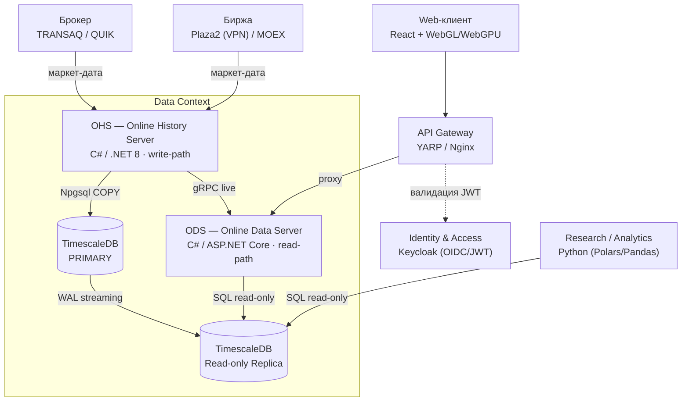

# Scinverse

Платформа анализа, хранения рыночных данных и автоматической торговли.
Сервис-ориентированная архитектура с мульти-стеком: **C#/.NET** для высоконагруженных сервисов данных и исполнения, **Python** для исследований и аналитики, **React + WebGL** для визуализации, **PostgreSQL + TimescaleDB** для хранения временных рядов.

## Архитектура (обзор)



## Стек

| Компонент | Технология |
| :--- | :--- |
| Сервисы данных / исполнения | C# / .NET 8 (Worker, ASP.NET Core) |
| Хранилище | PostgreSQL 16 + TimescaleDB (Primary + Replica) |
| Исследования / аналитика | Python (Polars, Pandas) |
| Визуализация | React + TypeScript + WebGL/WebGPU |
| Аутентификация | Keycloak (OIDC / JWT) |
| Кромка API | YARP / Nginx |

## Технологические решения

### Бэкенд: C# и Python

- **C# — ядро и высоконагруженные части.** Обеспечивает производительность и надёжность, критичные для обработки рыночных данных в реальном времени и управления ордерами; строгая типизация снижает риск ошибок в горячем контуре. Такой подход применяется в institutional-grade системах (например, движок LEAN от QuantConnect).
- **Python — исследования, анализ данных и прототипирование.** Используется для разработки и проверки торговых стратегий с опорой на экосистему Data Science (`Pandas`, `Polars`; `Polars` эффективнее на больших объёмах). Подходит для сервисов, где важнее гибкость, чем сверхнизкая задержка.

### Хранилище: PostgreSQL + TimescaleDB

- **Автоматическое партиционирование по времени** ускоряет запросы к временным рядам.
- **Сжатие данных** (до ~90 %) экономит место на диске.
- **Ускорение типовых рыночных запросов** относительно «ванильного» PostgreSQL.
- **Observability:** Prometheus (сбор метрик) и Grafana (визуализация); Jaeger — трассировка запросов между сервисами.

### Визуализация: React + WebGL

Объём и частота обновления рыночных данных исключают стандартные библиотеки (например, `chart.js`). Ориентир — WebGL-решения: `@mg-exchange/charts` (до 60 fps на 100 000 свечей, интеграция с React, набор индикаторов и инструментов рисования), `KLineChartQuant`.

### Обмен сообщениями: Kafka (асинхронный контур)

Apache Kafka используется в **холодном (асинхронном) контуре** для межсервисного обмена:

- потоковая передача данных в аналитику и историю;
- асинхронная обработка событий между сервисами;
- гарантированная доставка.

> В **горячем торговом контуре** Kafka не применяется: данные идут от коннектора к агентам напрямую, а ingestion OHS пишет в хранилище через `COPY`.

## Monorepo и Docs-as-Code

Проект развивается как **монорепозиторий** с единым git origin. Документация версионируется в git рядом с кодом (**Docs-as-Code**): архитектурные диаграммы описаны текстом (PlantUML / Mermaid) и ревьюются вместе с изменениями кода.

```
scinverse/                      # монорепо (единый origin)
├── docs/                       # версионируемая документация
│   ├── concept.md              # концептуальные решения (клиент, визуализация)
│   ├── ohs.md                  # модель данных и хранилище OHS
│   ├── promt.md                # исходные требования и выбор стека
│   └── architecture/c4/        # диаграммы (.puml) + arch.md
└── services/                   # сервисы (по мере разработки)
    └── online-history-server/  # OHS — следующий шаг
```

Ключевые документы:

- [`docs/architecture/c4/arch.md`](docs/architecture/c4/arch.md) — диаграммы (DDD Context Map + C4) и концепт-решения.
- [`docs/concept.md`](docs/concept.md) — концептуальные решения.
- [`docs/ohs.md`](docs/ohs.md) — модель данных и хранилище OHS.