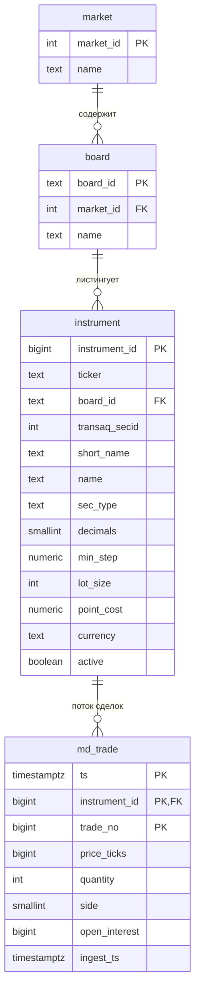
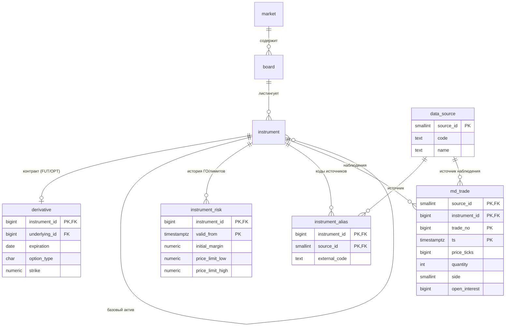
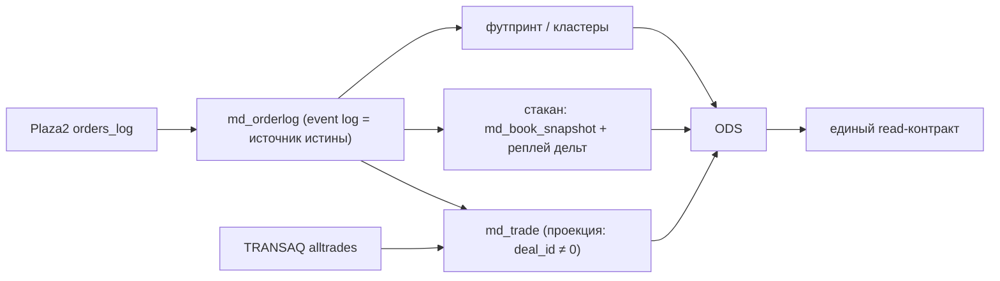
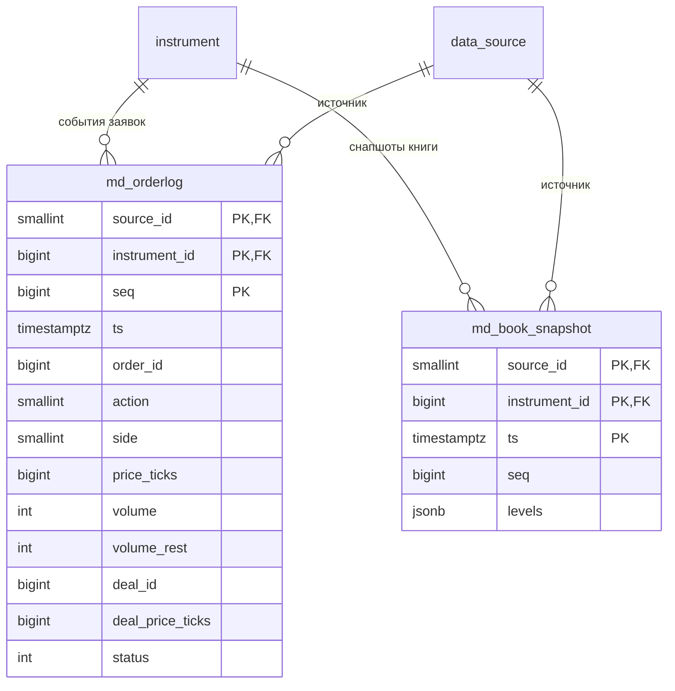

# Проектирование БД OHS/ODS

Документ фиксирует решения по модели данных: нормализация, декомпозиция справочника
инструментов, происхождение данных (мультиисточник), агрегация по таймфреймам и потоки
рыночных данных (OrderLog как источник истины).
Формат — «вопрос → варианты → решение → статус», чтобы видеть и историю, и обоснование.

Статусы: **DONE** — уже в миграциях; **PLANNED** — согласовано, ждёт реализации;
**FUTURE** — обсуждено, реализуем позже.

## Принципы

- **Суррогатные ключи.** Инструмент идентифицируется внутренним `instrument_id`
  (`BIGINT IDENTITY`), а не натуральным строковым ключом. Бизнес-ключ `(ticker, board)`
  — отдельное `UNIQUE`-ограничение.
- **Цена в ticks.** Хранение цены как `price_ticks BIGINT` (шаг цены в `instrument.min_step`);
  без чисел с плавающей точкой.
- **Каждая таблица — одна зависимость.** Атрибут живёт там, где его детерминант: свойства
  инструмента → `instrument`; атрибуты только деривативов → подтип-таблица; волатильные
  во времени параметры → темпоральная таблица; наблюдения (факты) → таблицы рыночных данных.
- **Факты ссылаются на `instrument_id`** и не дублируют справочные поля (`ticker`, `min_step`,
  и т.п.).

## Текущая схема (после закрытия 3НФ)



`md_trade` — hypertable TimescaleDB (партиции по `ts`, чанки 1 день).

---

## Решение 1. Убрать `instrument.market_id` (3НФ) — **DONE**

**Вопрос.** У `instrument` были и `board_id`, и `market_id`. Нужно ли хранить `market_id`
на инструменте?

**Анализ.** Рынок функционально определяется бордом: `instrument_id → board_id → market_id`.
`market_id` — непрайм-атрибут, транзитивно зависящий от PK через `board_id` → нарушение 3НФ
(при допущении «борд принадлежит ровно одному рынку», что верно для MOEX/TRANSAQ).

**Варианты.**
- **A. Убрать `market_id` из `instrument`**, рынок выводить джойном `instrument → board → market`.
  Стоимость джойна ничтожна (справочники крошечные; на горячем пути инструмент резолвится
  через кэш `InstrumentRegistry`).
- B. Осознанная денормализация ради JOIN-less запросов. Реального узкого места нет.

**Решение — A.** Столбец удалён из `V001`, из `InstrumentStore.UpsertAsync` и из схемы в
`docs/ohs.md`. Вставки в `market`/`board` сохранены (у `board` FK на `market`).

---

## Решение 2. Декомпозиция справочника инструментов — **DONE (V003)**

**Вопрос.** Выносить ли «спецификацию инструмента» в отдельные таблицы?

**Анализ.** Тут смешаны три разные сущности с разными детерминантами:

1. **Статическая спека инструмента** (`decimals`, `min_step`, `lot_size`, `point_cost`,
   `currency`) — зависит прямо от `instrument_id`, меняется редко. 3НФ **не требует** выноса
   → оставляем в `instrument`.
2. **Атрибуты деривативов** (`underlying`, `expiration`, `strike`, `option_type`) — есть только
   у FUT/OPT. В общем `instrument` они были бы почти всегда `NULL` (разрежённость) и мешали бы
   фильтрации опционных цепочек → **подтип-таблица** (class-table inheritance).
3. **Волатильные риск-параметры** (ГО/`initial_margin`, ценовые лимиты) — детерминант
   `(instrument_id, valid_from)`, меняются часто, нужна история → **темпоральная таблица**.
   Хранить одной колонкой в `instrument` нельзя — потеряется история и строка будет «дёргаться».

**Варианты для 1 (статическая спека).**
- A. Оставить в `instrument` (по умолчанию).
- B. Отдельная темпоральная `instrument_spec` (SCD type 2) — только если понадобится история
  `min_step`/`lot_size`. Пока не нужно.

**Решение.** Статику оставляем в `instrument` (вариант A). Добавляем `derivative` и
`instrument_risk`. `transaq_secid` обобщаем до `instrument_alias` (см. Решение 3).

### Целевые таблицы

```sql
-- Атрибуты контракта (только FUT/OPT), 1:1 с instrument
derivative (
    instrument_id BIGINT  PRIMARY KEY REFERENCES instrument (instrument_id),
    underlying_id BIGINT  NOT NULL REFERENCES instrument (instrument_id), -- базовый актив
    expiration    DATE    NOT NULL,
    option_type   CHAR(1),        -- 'C'/'P'; NULL для фьючерса
    strike        NUMERIC         -- NULL для фьючерса
);
CREATE INDEX ix_derivative_chain ON derivative (underlying_id, expiration, strike);

-- Волатильные риск-параметры с историей
instrument_risk (
    instrument_id    BIGINT      NOT NULL REFERENCES instrument (instrument_id),
    valid_from       TIMESTAMPTZ NOT NULL,
    initial_margin   NUMERIC,     -- ГО
    price_limit_low  NUMERIC,
    price_limit_high NUMERIC,
    PRIMARY KEY (instrument_id, valid_from)
);
```

**Пример пользовательского запроса** (опционная цепочка на базовый актив):

```sql
SELECT d.instrument_id, i.ticker, d.strike, d.option_type
FROM   derivative d
JOIN   instrument u ON u.instrument_id = d.underlying_id
JOIN   instrument i ON i.instrument_id = d.instrument_id
WHERE  u.ticker = 'RTS'
  AND  d.expiration = DATE '2026-09-15'
  AND  d.option_type = 'C'
ORDER BY d.strike;
```

Индекс `(underlying_id, expiration, strike)` покрывает выборку цепочки.

> Если ГО прилетает интрадей и часто — `instrument_risk` можно сделать hypertable, а «текущее»
> значение брать `ORDER BY valid_from DESC LIMIT 1` или через continuous aggregate.

---

## Решение 3. Происхождение данных / мультиисточник — **DONE (вариант A, V004)**

> **Статус (V004, phase 5).** Реализованы `data_source` (сид `transaq`/`synthetic`/`qscalp`) и
> `md_trade.source_id` в PK `(instrument_id, source_id, trade_no, ts)` + FK. Сквозной `SourceId`
> протянут через пайплайн (`IMarketConnector.SourceCode` → `ISourceStore` → `TradeRecord` →
> `TimescaleTradeWriter`). Нахлёст источников проверен интеграционным тестом. **Отложено (future):**
> `instrument_alias` (обобщение `transaq_secid`) — пока источник один на инструмент; `source_id`
> в `md_orderlog`/`md_book_snapshot` — Stage 2.

**Вопрос.** Данные по одному инструменту могут приходить из нескольких источников (TRANSAQ,
Finam, QScalp-storage), в т.ч. с **нахлёстом** по времени. Отличие — только в источнике.
Нужно понимать, кто предоставил данные. Сейчас источник **нигде не учитывается** — модель
неявно однопровайдерная (TRANSAQ).

**Проблемы текущей модели.**
- Тиковый дедуп `md_trade` держится на PK `(instrument_id, trade_no, ts)` и предполагает единый
  авторитетный `trade_no`. Разные источники могут не давать `trade_no`, округлять `ts` иначе,
  нумеровать по-своему → дубли или потеря наблюдений, и нельзя ответить «откуда строка».
- Для баров/свечей без источника в ключе `ON CONFLICT` затрёт бар одного провайдера баром
  другого за тот же `(instrument, tf, time)`.

**Варианты.**
- **A. `source_id` в ключе факта.** По копии наблюдения на источник; нахлёсты сохраняются;
  какой источник показывать — решаем на чтении (приоритет источников / выбор пользователя).
  Полное происхождение.
- B. `source_id` как атрибут вне ключа. Кросс-источниковый дедуп по бирже, но происхождение
  теряется (пишет «кто первый»). Лоссово.

**Решение — A.** Источник — свойство **наблюдения**, а не инструмента (инструмент один и тот же).
Поэтому `source_id` уходит на факты и **входит в PK**.

### Целевые таблицы

```sql
-- Справочник источников (аналог market/board)
data_source (
    source_id SMALLINT PRIMARY KEY,
    code      TEXT NOT NULL UNIQUE,   -- 'TRANSAQ' / 'FINAM' / 'QSCALP'
    name      TEXT
);

-- Провайдер-специфичные коды инструмента (обобщение transaq_secid)
instrument_alias (
    instrument_id BIGINT   NOT NULL REFERENCES instrument (instrument_id),
    source_id     SMALLINT NOT NULL REFERENCES data_source (source_id),
    external_code TEXT     NOT NULL,  -- transaq secid / finam symbol / ...
    PRIMARY KEY (instrument_id, source_id)
);

-- md_trade: source_id в PK → провенанс + сохранение нахлёстов
-- PRIMARY KEY (source_id, instrument_id, trade_no, ts)
```

### Схема с провенансом (целевая)



### Политика нахлёста (read-path / ODS)

- Данные хранятся по всем источникам (вариант A).
- На чтении разрешение по **приоритету источников** (напр. TRANSAQ > Finam > QScalp) или
  явным выбором пользователя; при необходимости — «канонизированная» серия, собранная по
  приоритету.

### Влияние на конвейер

- `SourceId` добавляется в `TradeEvent`/`TradeRecord`; каждый `IMarketConnector` знает свой
  источник; нормализатор/писатель протаскивают его до `md_trade`.
- `transaq_secid` из `instrument` переезжает в `instrument_alias` как частный случай.

---

## Решение 4. Агрегация по таймфреймам (свечи/футпринты) — **FUTURE**

**Вопрос.** Как строить бары `1m/5m/1H/1D/…` и производные?

**Анализ (сравнение с эталоном BackTraderDb example).** В эталонной реализации (минимальный
трейдерский стек на SQLite, см. Приложение A) старшие ТФ — это `VIEW` поверх базового `M5`.
Бакет считается вручную арифметикой над Unix-эпохой (`unixepoch(datetime) / 60 / 60 / 24` —
номер дня), а `open`/`close` вытаскиваются self-join'ами с `HAVING datetime = MIN/MAX(datetime)`,
т.к. в SQLite нет `first()`/`last()`. `VIEW` **не материализованы** → пересчитываются на каждом
чтении; на объёме это даёт нелинейную деградацию (эталон демонстрирует рост времени запроса при
переходе на более крупный ТФ). Для маленькой SQLite приемлемо, для нашего потока — нет.

**Решение.** TimescaleDB **continuous aggregates** (материализуются, досчитываются
инкрементально). Ручная epoch-арифметика заменяется на `time_bucket()`, а self-join'ы для
`open`/`close` — на нативные `first()`/`last()` (или `candlestick_agg` из Timescale Toolkit).
Дисциплина:
- группировка/ссылка по `instrument_id` (+ `source_id`, согласованно с Решением 3);
- **без дублирования** справочных полей (`ticker`, `min_step`, …) — добираются джойном к
  `instrument`;
- цена агрегируется в ticks (`price_ticks`), обратное представление в деньги — на чтении/в ODS.

```sql
-- Дневные свечи как continuous aggregate поверх ленты сделок.
-- Эквивалент эталонного VIEW d1, но материализованный и инкрементальный.
CREATE MATERIALIZED VIEW md_bar_1d
WITH (timescaledb.continuous) AS
SELECT
    instrument_id,
    source_id,
    time_bucket('1 day', ts)   AS bucket,       -- вместо unixepoch(ts)/60/60/24
    first(price_ticks, ts)     AS open_ticks,    -- вместо self-join HAVING ts = MIN(ts)
    max(price_ticks)           AS high_ticks,
    min(price_ticks)           AS low_ticks,
    last(price_ticks, ts)      AS close_ticks,   -- вместо self-join HAVING ts = MAX(ts)
    sum(quantity)              AS volume
FROM md_trade
GROUP BY instrument_id, source_id, bucket
WITH NO DATA;

SELECT add_continuous_aggregate_policy('md_bar_1d',
    start_offset      => INTERVAL '3 days',
    end_offset        => INTERVAL '1 hour',
    schedule_interval => INTERVAL '1 hour');
```

Соответствие приёмов эталона и нашего стека:

| BackTraderDb example (SQLite)                        | Scinverse (TimescaleDB)                                   |
| ---------------------------------------------------- | --------------------------------------------------------- |
| `unixepoch(datetime) / 60 / 60 / N` — номер бакета   | `time_bucket('N', ts)`                                    |
| `MAX(high)`, `MIN(low)`, `SUM(volume)`               | те же агрегаты                                            |
| `open` через self-join + `HAVING ts = MIN(ts)`       | `first(open, ts)`                                         |
| `close` через self-join + `HAVING ts = MAX(ts)`      | `last(close, ts)`                                         |
| весь OHLCV одной операцией                            | `candlestick_agg(ts, price, volume)` (Toolkit)            |
| `VIEW` (пересчёт на каждом чтении)                   | `MATERIALIZED VIEW … WITH (timescaledb.continuous)`       |
| `datetime_close = (bucket + 1) * 86400`              | граница бакета: `time_bucket(...) + INTERVAL 'N'`         |
| более крупные ТФ — отдельные `VIEW` поверх `M5`       | иерархия continuous aggregates (rollup ca → ca)           |

---

## Решение 5. OrderLog (Plaza2) как источник истины — **PLANNED**

**Вопрос.** Источник Plaza2/CGate от MOEX (поток `FORTS_ORDLOG_REPL`, таблица `orders_log`)
отдаёт не агрегированный стакан, а **детализированный журнал заявок** (order-by-order): поток
действий `add/delete` над идентифицированными заявками (`id_ord`), с исполнениями (`id_deal`).
Это принципиально богаче стакана и критично для аналитики ордер-флоу. Как заложить его в модель?

**Анализ.**
- **Стакан** — это *состояние* «цена → суммарный объём»; агрегат, теряющий структуру.
- **OrderLog** — это *журнал событий* по заявкам, из которого **выводится всё остальное**: стакан
  (реплеем `add/delete/modify`), лента сделок (события с `id_deal <> 0`), футпринт/кластеры.
- Значит OrderLog — **источник истины (event log)**, а стакан и лента — **производные проекции**
  (event sourcing, подход QScalp: хранить плотный сырой лог, реконструировать DOM на чтении).
- Разные источники дают **разную гранулярность**: TRANSAQ — `alltrades` (лента первична), Plaza2 —
  полный orderlog (лента и стакан производны). Канонический **read-контракт** для потребителя —
  единый; гетерогенность источника прячется за нормализацией.

> **Анонимность.** Публичный `orders_log` анонимен по клиенту: есть `id_ord` (заявка), нет
> `client_id`. «Поведение участников» реконструируется из **паттернов ордер-флоу по заявкам**
> (жизненный цикл заявки, айсберги, cancel/replace, агрессор vs пассив), а не из личности клиента.
> Поля `client_code/login_from/…` есть только в **приватном** потоке собственных заявок.

**Валидация легаси (Plaza2CGate).** Схема `orders_log` и реконструкция подтверждают дизайн 1‑в‑1:
книга собирается реплеем в `activeOrders: Dictionary<id_ord, Order>` (живые заявки по id) +
`aggregateOrders: Dictionary<price, Order>` (агрегат по цене = DOM); сделки выделяются при
`id_deal <> 0` и собираются в ленту.

**Варианты.**
- **A. OrderLog — единый источник истины, лента/стакан — деривации** (event sourcing). Нет
  рассинхронов, естественно ложится на bronze→silver→gold и hot/cold.
- B. Хранить orderlog «сбоку», а трейды/стакан вести независимо. Дублирование и риск рассинхрона.

**Решение — A.** Для источников с orderlog (Plaza2) сырой журнал первичен; `md_trade` и стакан для
них — производные. `source_id` в ключе (согласованно с Решением 3); `isin_id` источника резолвится
через `instrument_alias`.

### Целевые таблицы

```sql
-- Журнал заявок (event log). Маппинг полей FORTS_ORDLOG_REPL.orders_log в комментариях.
md_orderlog (
    source_id        SMALLINT    NOT NULL,   -- Plaza2 (Решение 3)
    instrument_id    BIGINT      NOT NULL,   -- резолв isin_id через instrument_alias
    seq              BIGINT      NOT NULL,   -- = replRev: монотонный порядок реплея
    ts               TIMESTAMPTZ NOT NULL,   -- moment (µs)
    order_id         BIGINT      NOT NULL,   -- id_ord (ЗАЯВКА, не клиент)
    action           SMALLINT    NOT NULL,   -- 0=delete, 1=add
    side             SMALLINT    NOT NULL,   -- dir → 1=buy, -1=sell
    price_ticks      BIGINT      NOT NULL,   -- price / min_step
    volume           INT         NOT NULL,   -- amount (объём действия)
    volume_rest      INT,                    -- amount_rest (остаток в заявке)
    deal_id          BIGINT,                 -- id_deal (>0 → исполнение/fill)
    deal_price_ticks BIGINT,                 -- deal_price / min_step
    status           INT,                    -- сырые флаги (в т.ч. конец бизнес-транзакции)
    PRIMARY KEY (source_id, instrument_id, seq)
);
-- hypertable по ts; порядок реплея гарантирует seq (=replRev)

-- Периодические снапшоты книги для быстрого чтения (снапшот + дельты вместо полного реплея).
md_book_snapshot (
    source_id     SMALLINT    NOT NULL,
    instrument_id BIGINT      NOT NULL,
    ts            TIMESTAMPTZ NOT NULL,
    seq           BIGINT      NOT NULL,        -- ревизия, на которой снят снапшот
    levels        JSONB       NOT NULL,        -- [{price_ticks, side, volume}, ...] или бинарно
    PRIMARY KEY (source_id, instrument_id, ts)
);
```

### Проекции (деривации из OrderLog)



### Схема (OrderLog в модели)



### Влияние на конвейер / канон

- Доменный канон: новый тип события `OrderLogEvent : IMarketMessage` (рядом с `TradeEvent`,
  `OrderBookEvent`). Легаси-абстракции `IFootprint`/`IClaster` — downstream-агрегаты **поверх**
  OrderLog, а не отдельный источник.
- `IMarketConnector` Plaza2 отдаёт `OrderLogEvent`; нормализатор резолвит `isin_id → instrument_id`
  и пишет в `md_orderlog`. Лента `md_trade` для Plaza2 — проекция (`deal_id <> 0`), а не отдельный
  приём.
- Реконструкция DOM: `activeOrders`(by `order_id`) + агрегат(by `price_ticks`); снапшоты в
  `md_book_snapshot` каждые N событий/секунд, между ними — реплей дельт из `md_orderlog`.
- Плотность: `price_ticks` + дельта-кодирование + колоночная компрессия TimescaleDB (orderlog
  объёмный — каждый add/cancel).

---

## Открытые вопросы

- **Стакан/котировки (`md_quote`, `md_orderbook`)** — те же принципы: `source_id` в ключе,
  ссылка на `instrument_id`. Для источников с orderlog (Plaza2) стакан — **проекция** `md_orderlog`
  (Решение 5); для источников без orderlog — самостоятельный поток. Схема — отдельным решением.
- **Частота снапшотов книги** (`md_book_snapshot`) — баланс «размер снапшота ↔ длина реплея дельт».
- **Приоритет источников** — где хранить (таблица `data_source.priority` или конфиг ODS).
- **`instrument_risk` как hypertable** — решать по фактической частоте обновления ГО.
- **История статической спеки** (`instrument_spec`, SCD2) — вводить только при реальной
  потребности.

---

## Приложение A. Reference из BackTraderDb example

**Что это.** BackTraderDb example — минимальный трейдерский стек хранения на SQLite (таблица
свечей + справочник тикеров + watermark последней вставки, набор запросов и представлений). Он
взят как эталон «как это делают руками на маленькой БД». Ниже — ценные приёмы и то, **как они
ложатся на объектную модель и архитектуру Scinverse**. Дословный SQL приведён для наглядности;
в нашем стеке он переписывается по таблице соответствия из Решения 4.

### A.1. Соответствие сущностей

| BackTraderDb example         | Scinverse                                                        |
| ---------------------------- | ---------------------------------------------------------------- |
| `bars(dataname, tf, datetime, o/h/l/c, volume)` | лента `md_trade` (факты) → `md_bar_*` (continuous aggregates) |
| `symbol_info(dataname, board, symbol, decimals, min_step, lot_size, …)` | справочник `instrument` (+ `board`, `market`) |
| `last_inserted(dataname, tf, datetime)` + триггер | watermark свежести/ingestion (см. A.3) |
| натуральный ключ `(dataname, tf, datetime)` | суррогат `instrument_id` + `ts` (+ `source_id`) |

Ключевое расхождение: эталон опирается на **натуральный составной ключ** и денормализацию ради
скорости; Scinverse — на **суррогатный `instrument_id`**, нормализацию (3НФ) и вынос
материализации в continuous aggregates. Причина: у нас мультиисточник (Решение 3), кросс-биржевые
инструменты и объёмы, где натуральный ключ и пересчитываемые `VIEW` не тянут.

### A.2. Идемпотентность через первичный ключ

Эталон подчёркивает: без PK база принимает дубли; составной PK `(dataname, tf, datetime)` создаёт
unique-constraint и физически отсекает повторную вставку той же свечи. Мотивация именно
трейдерская — «никогда не получить дубль, по которому построишь индикатор и примешь неверное
решение».

**В Scinverse:** та же дисциплина — PK на факт-таблицах + `ON CONFLICT DO NOTHING`. Отличие: ключ
суррогатный и включает `source_id` (Решение 3), а идемпотентность уже проверена интеграционными
тестами `TimescaleTradeWriter` (дедуп батча).

### A.3. Watermark последней вставки

Эталон держит таблицу `last_inserted(dataname, tf, datetime)` и обновляет её `AFTER INSERT`-триггером
(`INSERT OR REPLACE … strftime(...,'now','+3 hours')`) — «когда последний раз обновлялся тикер+ТФ».
Сценарий: если инструмент не обновлялся N дней → исключить из торгуемого списка.

**В Scinverse:** это **watermark свежести** для мониторинга и возобновления загрузки (resume). Но
триггер на горячем пути дорогой — вместо него отдельная метадата-таблица `ingestion_watermark`
(или запрос `max(ts)` по инструменту/источнику). Ложится в контур мониторинга OHS (список
инструментов, гэпы, лаг записи).

### A.4. Спецификация тикера и (де)нормализация

Эталон держит спеку в `symbol_info(decimals, min_step, lot_size, …)` с PK `dataname` и **сознательно
денормализует** `last_updated` внутрь этой же таблицы (связь 1:1) — «зачем плодить сущности, если
значение одно».

**В Scinverse:** его `symbol_info` = наш справочник `instrument` (те же `decimals`, `min_step`,
`lot_size`). Его правило «не выноси статику 1:1» и наше решение вынести `instrument_risk` в
темпоральную таблицу (Решение 2) **не противоречат**: у него спека статична, у нас ГО/лимиты
версионируются во времени — выносим именно то, что имеет историю.

### A.5. Reference-запросы (read-path / ODS)

Эти запросы из эталона — готовые кандидаты в **data-quality отчёты ODS**. Приведены в исходном
SQLite-виде; в нашем стеке `dataname → instrument_id`, `tf/DATE(datetime)` → `time_bucket`/`ts`.

**Покрытие истории (первая/последняя дата по инструменту и ТФ):**

```sql
SELECT dataname, tf,
       MIN(datetime) AS min_datetime,
       MAX(datetime) AS max_datetime
FROM bars
GROUP BY dataname, tf
ORDER BY max_datetime DESC, min_datetime ASC;
```

**Количество пропущенных баров на дату** (`7` — общее число инструментов в наборе):

```sql
SELECT datetime,
       7 - COUNT(datetime) AS missed
FROM bars
WHERE tf = 'M5'
  AND DATE(datetime) = '2025-03-27'
GROUP BY datetime
HAVING missed > 0
ORDER BY datetime;
```

**Матрица пропусков (инструменты × время)** — «жёстко» захардкожена под 7 инструментов и 7
`LEFT JOIN`; эталон сам отмечает, что это не масштабируется. В Scinverse — параметризованный
pivot по инструментам (динамически по набору), либо агрегирующий отчёт на стороне ODS/Python:

```sql
SELECT t0.datetime,
       CASE WHEN t1.dataname = 'SPBFUT.CNYRUBF' THEN '+' ELSE NULL END AS 'CNYRUBF',
       CASE WHEN t2.dataname = 'SPBFUT.EURRUBF' THEN '+' ELSE NULL END AS 'EURRUBF',
       CASE WHEN t3.dataname = 'SPBFUT.GAZPF'   THEN '+' ELSE NULL END AS 'GAZPF',
       CASE WHEN t4.dataname = 'SPBFUT.GLDRUBF' THEN '+' ELSE NULL END AS 'GLDRUBF',
       CASE WHEN t5.dataname = 'SPBFUT.INDEXF'  THEN '+' ELSE NULL END AS 'INDEXF',
       CASE WHEN t6.dataname = 'SPBFUT.SBERF'   THEN '+' ELSE NULL END AS 'SBERF',
       CASE WHEN t7.dataname = 'SPBFUT.USDRUBF' THEN '+' ELSE NULL END AS 'USDRUBF'
FROM (
    SELECT datetime, COUNT(datetime) AS count_datetime
    FROM bars
    WHERE time_frame = 'M5' AND DATE(datetime) = '2025-03-27'
    GROUP BY datetime
    HAVING count_datetime < 7
    ORDER BY datetime
) AS t0
LEFT OUTER JOIN bars AS t1 ON t0.datetime = t1.datetime AND t1.dataname = 'SPBFUT.CNYRUBF'
LEFT OUTER JOIN bars AS t2 ON t0.datetime = t2.datetime AND t2.dataname = 'SPBFUT.EURRUBF'
LEFT OUTER JOIN bars AS t3 ON t0.datetime = t3.datetime AND t3.dataname = 'SPBFUT.GAZPF'
LEFT OUTER JOIN bars AS t4 ON t0.datetime = t4.datetime AND t4.dataname = 'SPBFUT.GLDRUBF'
LEFT OUTER JOIN bars AS t5 ON t0.datetime = t5.datetime AND t5.dataname = 'SPBFUT.INDEXF'
LEFT OUTER JOIN bars AS t6 ON t0.datetime = t6.datetime AND t6.dataname = 'SPBFUT.SBERF'
LEFT OUTER JOIN bars AS t7 ON t0.datetime = t7.datetime AND t7.dataname = 'SPBFUT.USDRUBF';
```

### A.6. Агрегация ТФ через VIEW (дословный эталон)

Полный `CREATE VIEW d1` из эталона — «как строят старший ТФ вручную». Маппинг на наш стек — в
Решении 4.

```sql
CREATE VIEW d1 AS
SELECT
    t0.dataname,
    datetime(t0.D1 * 24 * 60 * 60, 'unixepoch')       AS datetime,        -- начало бакета
    datetime((t0.D1 + 1) * 24 * 60 * 60, 'unixepoch')  AS datetime_close,  -- граница бакета
    t1.open,
    t0.high,
    t0.low,
    t2.close,
    t0.volume
FROM (
    SELECT dataname,
           MAX(high)   AS high,
           MIN(low)    AS low,
           SUM(volume) AS volume,
           unixepoch(datetime) / 60 / 60 / 24 AS D1   -- номер дня от эпохи = бакет
    FROM bars
    WHERE tf = 'M5'
    GROUP BY dataname, D1
) AS t0
INNER JOIN (
    SELECT dataname, open,
           unixepoch(datetime) / 60 / 60 / 24 AS D1
    FROM bars
    WHERE tf = 'M5'
    GROUP BY dataname, D1
    HAVING datetime = MIN(datetime)                    -- первый бар в бакете → open
) AS t1 ON t0.dataname = t1.dataname AND t0.D1 = t1.D1
INNER JOIN (
    SELECT dataname, close,
           unixepoch(datetime) / 60 / 60 / 24 AS D1
    FROM bars
    WHERE tf = 'M5'
    GROUP BY dataname, D1
    HAVING datetime = MAX(datetime)                    -- последний бар в бакете → close
) AS t2 ON t0.dataname = t2.dataname AND t0.D1 = t2.D1;
```

Для младших ТФ меняется только делитель бакета: `/ 60 / 15` (M15), `/ 60 / 30` (M30) и т.д.

### A.7. Граница SQL и разделение hot/cold

Эталон отдельно проговаривает **предел SQL**: язык силён в массовых линейных выборках, но плох в
нелинейной `if/else`-логике и тяжёлых отчётах; в реальной практике задачу «отчёт < 30 c» решали
**осознанным уходом от 3НФ к избыточности** (материализация). На ~1 млрд записей SQLite работает,
но сложные отчёты — долгие.

**В Scinverse** это прямое обоснование архитектуры:
- **hot-path** — нормализованный TimescaleDB + continuous aggregates (материализация «золотого»
  слоя вместо ручной денормализации);
- **cold-path** — Python для нелинейной аналитики и тяжёлых отчётов, которые неудобно/дорого делать
  на SQL;
- отчёты качества данных (A.5) — на стороне ODS, поверх агрегатов и watermark'ов.
