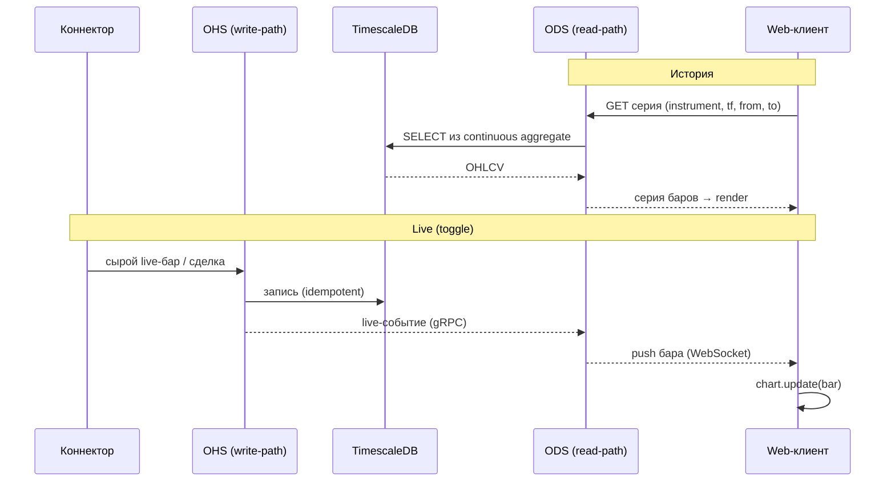

# UI и графика — стратегия рендеринга

> Документ фиксирует решение по клиентскому визуалу Scinverse: чем рисуем графики, где
> проходит граница между готовой библиотекой и собственным движком, и как клиент общается с
> read-path (ODS). Основан в т.ч. на разборе эталона **BackTraderDb example** (готовое
> desktop-приложение поверх `lightweight-charts`).

Статусы: **DONE** — зафиксировано; **PLANNED** — согласовано, ждёт реализации;
**FUTURE** — обсуждено, реализуем позже.

---

## 1. Контекст решения — **DONE**

Ранее принято (см. `docs/concept.md`, C4 в `docs/architecture/c4/`):

- **UI только web** (React + WebGL/WebGPU). Нативный desktop не делаем; при необходимости
  ручного скальпинг-кокпита — это отдельный **тонкий потребитель того же API**, а не монолит
  «коннектор + ТС».
- **Тонкий клиент + ODS как data-API.** Клиент не считает агрегаты и не ходит в БД напрямую: он
  запрашивает готовые серии у ODS (read-path) и получает live-поток. Вся тяжёлая подготовка
  (бары, футпринты) — на стороне СУБД (continuous aggregates, см. `db-design.md`, Решение 4).

Эталон BackTraderDb example подтверждает эту раскладку: сервер отдаёт данные, клиент только
рендерит; переключение таймфрейма/инструмента — это запрос к хранилищу, а не пересчёт на клиенте.

---

## 2. Эталон: `lightweight-charts` как приложение

Что демонстрирует эталон (для нас — «эскиз тонкого клиента»):

- **График свечей** с панелью цен, объёмами и легендой; переключатели ТФ (`M5/M10/M15/M30/M60/D1`)
  — все ТФ приходят **из БД** (базовый `M5` + агрегаты).
- **Режим Live** (toggle-кнопка): подписка на живые бары вкл/выкл. Живой бар приходит «когда можно
  торговать» (последний бар прилетает на открытии сессии), пушится по одному через `chart.update()`.
- **Двойной путь live-бара:** пришедший бар одновременно **и рисуется, и пишется в хранилище**.
  Для Scinverse это ровно связка OHS (write-path) + ODS (live-стрим): один источник, два потребителя.
- **Инструменты рисования** (встроены в библиотеку): трендовая линия, луч от точки, горизонтальный
  уровень на всю панель, вертикаль, прямоугольник (заливка + прозрачность); контекстное
  редактирование цвета/стиля/прозрачности, удаление.
- **UX:** выпадающий список инструментов, поиск по подстроке (Ctrl+F), fullscreen, pan/zoom по
  времени, полупрозрачные объёмы (чтобы не перетягивать внимание).
- **Точность цены** берётся из спецификации инструмента (`decimals`) — напр. 3 знака для юаня.

---

## 3. Ограничения `lightweight-charts`

Зафиксировано на версии эталона (`v4.1.3`); часть пунктов косметическая, часть — блокирующая для
профессионального визуала.

| Ограничение                                            | Тип        | Последствие для Scinverse                              |
| ------------------------------------------------------ | ---------- | ------------------------------------------------------ |
| Нет тепловых карт (heatmap)                            | блокирующее| heatmap ликвидности/стакан — только собственный слой   |
| Нет кластерного футпринта                              | блокирующее| футпринт — только собственный слой                     |
| Объёмы не «первого класса» (overlay-серия)             | ограничение| объём — отдельная полупрозрачная серия                 |
| Легенда округляет цену до 2 знаков (известный баг)     | баг        | точность гнать по `instrument.decimals`, обход/фикс     |
| Нельзя кастомизировать формат даты                     | косметика  | несущественно                                          |
| Нет градиента/тени под барами                          | косметика  | несущественно                                          |
| Минимальный `bar_spacing` (~10 px)                     | ограничение| предел сжатия по времени                               |

Вывод: `lightweight-charts` отлично закрывает **базовый ценовой график**, но принципиально не
покрывает профессиональные слои (футпринт, heatmap, DOM). Значит — гибрид.

---

## 4. Решение для Scinverse: слоистый рендеринг — **PLANNED**

**Решение.** Не выбирать «или-или», а разделить по слоям:

- **`lightweight-charts`** — базовый слой: свечи/бары, линии, объёмы, простые инструменты рисования.
  Быстрый старт, зрелая библиотека, покрывает 80% «обычного» графика.
- **Собственный движок на WebGL/WebGPU** — профессиональные слои, которых нет в готовых решениях:
  кластерный **футпринт**, **heatmap** ликвидности, **стакан/DOM**, плотные тиковые визуализации.

| Задача визуала                                    | Технология                       |
| ------------------------------------------------- | -------------------------------- |
| Свечи / бары / линии / объёмы                     | `lightweight-charts`             |
| Инструменты рисования (линия, луч, уровень, бокс) | `lightweight-charts` (встроенные)|
| Кластерный футпринт                               | собственный WebGL/WebGPU         |
| Heatmap ликвидности / тепловые карты              | собственный WebGL/WebGPU         |
| Стакан / DOM, плотные тики                        | собственный WebGL/WebGPU         |

> Легаси-наработки на C# (WPF/DirectX стакан и стокчарт) переиспользуются **как доменные модели и
> опыт** (`IStockElement → IBar → IFootprint → IDataSeries`), но не как UI: перенос на web даёт
> современную графику, которой на C#-стеке нет.

---

## 5. Контракт данных с ODS — **PLANNED**

Клиент работает с ODS двумя каналами: **история** (запрос серии) и **live** (push бара).

- **История:** запрос `(instrument_id, timeframe, from, to)` → серия OHLCV из continuous aggregate.
  Цена может отдаваться в ticks (`price_ticks`) + `min_step`/`decimals` инструмента, либо уже в
  деньгах — конверсия по `instrument.decimals` (аналог эталонного `decimals` → точность на графике).
- **Время:** бары адресуются началом бакета (`time_bucket`); опционально отдаём и границу бакета
  (аналог `datetime_close` в эталоне) для систем, считающих по времени закрытия.
- **Live:** OHS пишет бар/сделку в TimescaleDB и одновременно транслирует событие в ODS (gRPC);
  ODS пушит бар клиенту (WebSocket), клиент делает `chart.update(bar)` — один бар за раз.

---

## 6. UX-паттерны (из эталона, берём в web-клиент)

- Переключатель ТФ как набор кнопок (`M5…D1`), базовый — `M5`.
- Кнопка **Live** — toggle подписки; в выключенном состоянии — только история.
- Поиск инструмента по подстроке (Ctrl+F): по вхождению в тикер, а не только точный выбор.
- Полупрозрачные объёмы (alpha), чтобы не конкурировали с ценой за внимание.
- Точность цены — из `instrument.decimals`, а не хардкод «2 знака».
- Сохранение пользовательских рисунков (drawings) — открытый вопрос (см. ниже).

---

## 7. Открытые вопросы

- **Транспорт live-потока** ODS → клиент: WebSocket vs SSE vs gRPC-web (по нагрузке/латентности).
- **Формат серии:** ticks + `min_step` на клиенте vs готовые деньги с сервера (кто конвертирует).
- **Персистентность рисований** (drawings) — где хранить (профиль пользователя / локально) и как
  привязывать к инструменту и ТФ.
- **Версия `lightweight-charts`** (v5+): закрывает ли часть косметических ограничений (легенда,
  формат даты, градиенты) — пересмотреть при обновлении.
- **Граница «встроенный слой ↔ собственный движок»**: где именно проходит стык рендеринга, чтобы
  футпринт/heatmap слой синхронизировался по времени/масштабу с базовым графиком.
