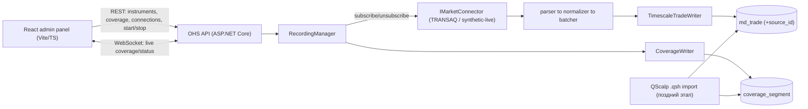

# Stage 1. OHS: управление записью + панель покрытия (Гант) — дизайн

Дизайн-документ Stage 1 (что и зачем строим). Верхнеуровневая дорожная карта и статусы фаз — в
[plan.md](plan.md); особенности реализации каждой фазы — в соответствующих `phaseN/apply.md`.

## Что строим

OHS перестаёт быть «воркером на статическом конфиге» и становится управляемым сервисом записи с
HTTP/WebSocket API и веб-панелью. Пользователь выбирает инструмент, стартует online-запись через
коннектор; на Ганте «колбаски» (сегменты покрытия) растут в реальном времени, цвет = источник данных,
разрывы видны визуально.

Фронт по сути — **админка OHS** (внутренний ops-инструмент, не публичный продукт). Отсюда упрощения
для MVP: одна SPA рядом с OHS, без тяжёлой авторизации/мультитенантности на этом этапе, API без
жёсткого версионирования.

## Граница: админка (запись) vs публичная часть (чтение)

Явное разделение по CQRS, совпадает с контекст-мапой OHS/ODS:

- **Админка = запись/управление = OHS (write-path).** Старт/стоп записи, coverage-Гант, создание и
  настройка подключений коннекторов через UI (CRUD, параметры, вкл/выкл, проверка), статус коннекторов,
  бэкфилл истории (`.qsh`-импорт — тоже админка, это наполнение). Узкий круг операторов, внутренний
  периметр.
- **Публичная часть = чтение/потребление = ODS (read-path), позже.** Свечи, агрегаты, выгрузка истории,
  стримы клиентам. Много потребителей, отдельная аутентификация (Keycloak/JWT), стабильный
  версионируемый контракт, независимое масштабирование.
- **Водораздел:** команды и наполнение → OHS/админка; запросы к данным → ODS/публичный API. Публичная
  часть ничего не пишет.

В рамках Stage 1 делаем **только админку/OHS**; публичный ODS — отдельный последующий трек.

## Coverage-модель: гибрид

- Сессии записи (start/stop пишет сегмент `(instrument, source, from, to)`) дают базовую колбаску.
- Поверх подсвечиваем **реальные внутрисессионные дыры**, вычисленные из `md_trade` (разрыв между
  соседними сделками больше порога `GapThreshold`).
- Разрыв **между** колбасками = период без активной сессии; дыра **внутри** колбаски = сессия была,
  а данных нет (напр. тихий обрыв связи).

```text
Колбаска (сессия): [███████████████████████████]   10:00–10:50
С подсветкой дыры: [██████]        [██████████████]  ← прореха 10:15–10:22
```

## Целевой поток



## Изменения модели данных (миграции)

- `V004__data_source_and_source_id.sql` (активирует Решение 3, вариант A — БД пустая):
  - `data_source(source_id SMALLINT PK, code TEXT UNIQUE, name TEXT)`, сид `transaq`, `synthetic`
    (и задел `qscalp`).
  - `md_trade`: добавить `source_id SMALLINT NOT NULL`, PK → `(instrument_id, source_id, trade_no, ts)`;
    пересоздать hypertable (данных нет).
- `V005__coverage_segment.sql`:
  - `coverage_segment(segment_id BIGINT IDENTITY PK, instrument_id BIGINT FK, source_id SMALLINT FK,
    started_at TIMESTAMPTZ NOT NULL, ended_at TIMESTAMPTZ NULL, trade_count BIGINT NOT NULL DEFAULT 0,
    status TEXT NOT NULL)`, индекс `(instrument_id, source_id, started_at)`. `ended_at IS NULL` = идёт
    запись. Это база гибрида (сессии); реальные дыры отдельной таблицей **не** хранятся.
  - Реальные дыры выводятся запросом из `md_trade` в границах сегмента: разрыв между соседними `ts`
    больше `GapThreshold` (напр. `LEAD(ts) OVER (...) - ts > interval`). Порог — в конфиге OHS.
- `V006__connector_connection.sql` (подключения коннекторов, управляемые из UI):
  - `connector_connection(connection_id BIGINT IDENTITY PK, source_id SMALLINT FK, name TEXT NOT NULL,
    kind TEXT NOT NULL, settings JSONB NOT NULL, enabled BOOLEAN NOT NULL DEFAULT TRUE,
    created_at/updated_at TIMESTAMPTZ)`. `kind` = тип коннектора (`transaq`/`synthetic`/...),
    `settings` — несекретные параметры (host/port/endpoints).
  - **Секреты (логин/пароль TRANSAQ) в открытую в `settings` не кладём** — см. заметку про хранение
    секретов.

## Контракт API (черновик)

- `GET /api/instruments` -> `[{ instrumentId, ticker, board, shortName }]`
- `GET /api/sources` -> `[{ sourceId, code, name }]`
- `GET /api/coverage?from&to` -> `[{ instrumentId, sourceId, from, to, tradeCount, status, gaps: [{ from, to }] }]`
  (`gaps` — реальные внутрисессионные дыры из `md_trade` по порогу `GapThreshold`)
- `GET /api/recordings` -> активные сессии + статус
- `POST /api/recordings` `{ instrumentId, connectionId }` -> старт live-записи, создаёт открытый сегмент
- `DELETE /api/recordings/{instrumentId}` -> стоп, закрывает сегмент
- `GET /api/connections` -> список подключений (без секретов) + статус (connected/disconnected/error)
- `POST /api/connections` / `PUT /api/connections/{id}` -> создать/изменить подключение
- `POST /api/connections/{id}/connect` / `.../disconnect` / `.../test` -> управление и проверка
- `WS /ws` -> сервер шлёт (throttled ~1/сек): `recordingStarted/Stopped`,
  `coverageExtended { instrumentId, sourceId, to, tradeCount }` (чтобы колбаски «ползли»),
  `connectionStatusChanged { connectionId, status }`.

## Ключевой рефакторинг: динамическая запись

Сейчас [`OhsWorker.cs`](../../services/online-history-server/src/Scinverse.Ohs.Host/OhsWorker.cs)
подписывается один раз на список из
[`OhsOptions.cs`](../../services/online-history-server/src/Scinverse.Ohs.Host/OhsOptions.cs). Нужен
`RecordingManager`, который держит набор активных записей и умеет `start/stop(instrumentId)` в рантайме
(для TRANSAQ — `SubscribeTradesAsync`/unsubscribe на одном коннекторе), поверх набора подключений из
`connector_connection` (фабрика коннекторов по `kind`). Сквозной `SourceId` добавляется в
[`TradeRecord.cs`](../../services/online-history-server/src/Scinverse.Ohs.Domain/TradeRecord.cs),
[`TradeNormalizer.cs`](../../services/online-history-server/src/Scinverse.Ohs.Ingestion/TradeNormalizer.cs)
и SQL в
[`TimescaleTradeWriter.cs`](../../services/online-history-server/src/Scinverse.Ohs.Storage.Timescale/TimescaleTradeWriter.cs)
(staging + insert + PK-конфликт по `source_id`).

## Порядок выполнения (фазы Stage 1)

1. **phase4 — Локальный E2E OHS (запись).** Прогнать хост против живой compose-БД (сначала fake),
   убедиться, что данные лежат в `md_trade`; сделать `SyntheticLiveConnector` (стримит сделки во
   времени, для живых колбасок и второго цвета). Отладка.
2. **phase5 — Мультиисточник.** `V004`, сквозной `source_id`. Нужен до coverage/фронта (цвет = источник).
3. **phase6 — Control-plane + coverage + подключения + API/WS.** `V005`, `V006`, `RecordingManager`,
   `CoverageWriter`, эволюция хоста в ASP.NET Core, REST + WebSocket.
4. **phase7 — Админ-фронт.** React+Vite+TS: список инструментов, Гант с цветными колбасками и
   подсветкой дыр, старт/стоп, экран управления подключениями. Можно начинать параллельно на моках API.
5. **phase8 — CI/CD.** GitHub Actions: restore/build + unit + integration (Testcontainers на
   ubuntu-раннере) + сборка фронта; compose-сервис `migrator`. Можно начинать рано (тесты уже есть).
6. **phase9 — Импорт истории QScalp `.qsh`.** Парсер + бэкфилл в `md_trade`/`coverage_segment` с
   `source=qscalp`; делает «исторические» колбаски реальными.

## Замечания / риски / открытые решения

- Эволюция хоста в ASP.NET Core затрагивает DI и запуск; воркер остаётся `HostedService`.
- `synthetic` источник нужен только чтобы показать второй цвет до появления `.qsh`-импорта; в проде —
  не сидировать/скрыть.
- Отписка TRANSAQ по инструменту — уточнить возможности нативного коннектора при реальной интеграции
  (для fake/synthetic тривиально).
- Гибрид coverage: колбаска (сессия) считается дёшево, а подсветка дыр — запрос-агрегация по `md_trade`;
  на больших окнах кешировать/ограничивать масштаб (по видимому диапазону Ганта).
- **Хранение секретов коннекторов (решить отдельно, перед phase6).** UI-редактирование подключений
  вводит секреты (логин/пароль TRANSAQ). Варианты: шифрование значений в БД (ключ вне БД), внешний
  secret-store, или ввод секретов только в рантайме без персиста. Секреты никогда не возвращаются в UI
  (write-only поля). До выбора — `settings` без секретов, credentials через защищённый механизм
  (user-secrets/env).
