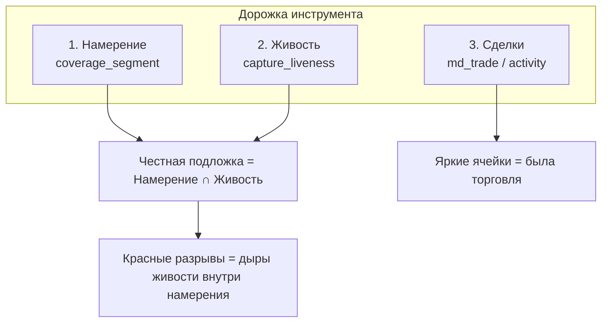
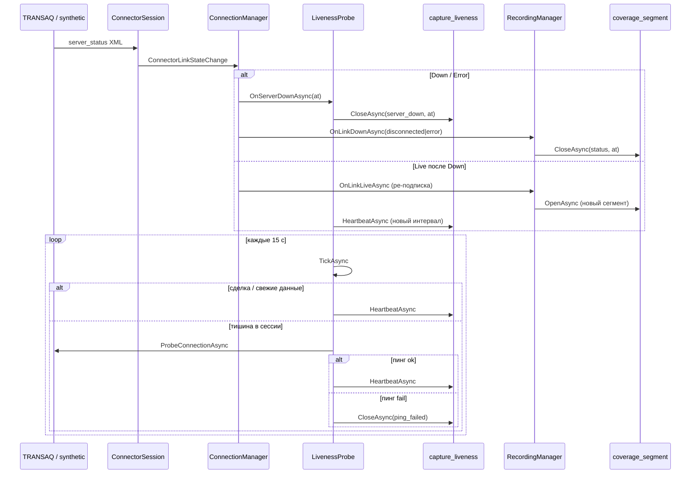

# Инциденты захвата (phase 7h)

Справочник по **инцидентам** в Online History Server: что это, какие бывают виды, как детектируем,
куда пишем, как строим журнал разрывов и как показываем на Ганте.

Связанные документы: [plan.md](plan.md), [report.md](report.md), [seed-capture-liveness-2026-07-11.sql](seed-capture-liveness-2026-07-11.sql).

---

## Что такое «инцидент»

В OHS **инцидент** — это **нарушение непрерывности захвата**: момент, когда пользователь держал запись
включённой (намерение есть), но **связь с провайдером или процесс захвата перестали быть живыми**.

Инцидент — **не** любая пауза на дорожке:

| Ситуация | Инцидент? | Почему |
|----------|-----------|--------|
| Тихий рынок (нет сделок, связь жива) | **Нет** | Подложка (живость) есть → мы писали, рынок молчал |
| Пользователь нажал «стоп» | **Нет** | Намеренная остановка (`stopped`) |
| Конец торговой сессии MOEX | **Нет** | Штатное закрытие живости (`stopped` на `session.End`) |
| Обрыв интернета / `server_status=false` | **Да** | `server_down` |
| DLL «умерла» без явного disconnect | **Да** | `ping_failed` |
| Краш/рестарт OHS, пропуск тиков хартбита | **Да** | `interrupted` |
| Запись не включали | **Нет** | Нет намерения → пустая дорожка |

**Дискриминатор (главное правило):**

> Есть честная подложка в момент дыры → захват шёл → дыра в сделках = тихий рынок.  
> Нет подложки внутри намерения → захват прервался → **инцидент** (кандидат на backfill).

Подложка **никогда** не рвётся из‑за тишины в сделках — только по явному сигналу «связь вниз» / стоп /
отсутствию живости.

---

## Три слоя дорожки Ганта

Инциденты живут на пересечении слоёв:



| Слой | Сущность | Таблица | Единица | Что хранит |
|------|----------|---------|---------|------------|
| **Намерение** | сегмент записи | `coverage_segment` | инструмент × source | «пользователь хотел писать» `[started_at … ended_at]` |
| **Живость** | интервал захвата | `capture_liveness` | **source** (подключение) | «связь жива, хартбит идёт» `[from_ts … to_ts]` |
| **Сделки** | сделки | `md_trade` | инструмент × source | факт торговли (слой 7g) |

**Честная подложка** = пересечение сегмента намерения с интервалами живости его провайдера.  
**Инцидент на UI** = зазор между интервалами живости **внутри** span намерения.

---

## Виды инцидентов (таксономия)

### 1. Причины закрытия живости (`close_reason`)

Хранятся в `capture_liveness.close_reason` при закрытии интервала (`open = false`).
Миграция: `V011__capture_liveness_reason.sql`.

| Код | Русское имя | Инцидент? | Как возникает |
|-----|-------------|-----------|---------------|
| `server_down` | Обрыв связи | **Да** | `server_status connected="false"` или `error` от TRANSAQ/synthetic; `ConnectionManager` → `LivenessProbe.OnServerDownAsync` |
| `ping_failed` | Тихая смерть (пинг) | **Да** | Тишина в сессии, коннектор формально connected, но `ProbeConnectionAsync` не прошёл или `IsConnected = false` |
| `interrupted` | Прерывание процесса | **Да** | Пропуск тиков хартбита > `maxGap` (~45 с); recovery на старте хоста; осиротевший открытый интервал |
| `stopped` | Штатная остановка | **Нет** | Стоп записи пользователем; disconnect; конец торговой сессии MOEX |

Инвариант БД: `(open AND close_reason IS NULL) OR (NOT open AND close_reason IS NOT NULL)`.

### 2. Статусы сегмента намерения (`coverage_segment.status`)

Миграция: `V009__coverage_interrupted_status.sql`.

| Статус | Инцидент? | Когда ставится |
|--------|-----------|----------------|
| `recording` | — | Сегмент открыт, запись идёт |
| `stopped` | **Нет** | Пользователь остановил запись |
| `disconnected` | **Да** | Связь `Down` при активной записи |
| `error` | **Да** | Связь `Error` (например timeout в `server_status`) |
| `interrupted` | **Да** | Recovery: процесс упал, сегмент остался с `ended_at IS NULL` |

Статус сегмента отвечает на вопрос **«почему закрыли намерение»** и даёт **красный шов** на правом крае
закрытого сегмента. Геометрию дыры задаёт живость.

### 3. Состояния автомата связи (коннектор)

`ConnectorLinkState` — runtime, не персистится отдельной таблицей.

```
Disconnected → Connecting → Live ⇄ Degraded → Down/Error → (reconnect) → Live
```

| Состояние | XML `server_status` | Статус подключения в UI |
|-----------|---------------------|-------------------------|
| `Live` | `connected="true"` | `waiting` / `active` |
| `Degraded` | `connected="true" recover="true"` | `degraded` (жёлтый, ре-подписка) |
| `Down` | `connected="false"` | `disconnected` |
| `Error` | `connected="error"` | `error` |

Парсер: `TransaqServerStatusParser`. События идут непрерывно через `ConnectorSession` →
`ConnectionManager.HandleLinkStateAsync`.

### 4. Журнал разрывов (`CaptureGap`)

**Отдельной таблицы инцидентов нет.** Журнал — **производная** от `capture_liveness`:

```
разрыв = [to_ts закрытого интервала, from_ts следующего)
причина = close_reason закрытого интервала
```

Условия попадания в журнал (`QueryGapsAsync`):

- `close_reason IN ('server_down', 'ping_failed', 'interrupted')`
- `stopped` **исключается** — это не разрыв
- `gap_to IS NULL` → разрыв **ещё длится** (связи нет, следующий интервал не открыт)

Тот же журнал можно восстановить на фронте: `gapsFromLivenessIntervals()` в `coverageGeometry.ts`.

---

## Детекция и обработка (pipeline)

### Источники сигналов



### LivenessProbe (писатель живости)

Файл: `LivenessProbe.cs`. Тик **15 с** (`OhsOptions.LivenessProbeSeconds`, половина минимального бакета 7g).

Приоритет на тике (для подключений с активными записями):

1. **Вне торговой сессии / праздник** — тик пропускается (тишина законна).
2. **После `session.End`** — `CloseAsync(stopped, session.End)`.
3. **Свежие данные** (`now - lastData ≤ 15 с`) — `HeartbeatAsync` без пинга.
4. **Тишина в сессии** — активный пинг:
   - не connected → `ping_failed`;
   - пинг не прошёл → `ping_failed`;
   - пинг ok → `HeartbeatAsync`.

`server_down` приходит **мгновенно** из `server_status`, не ждёт тика 15 с.

### HeartbeatAsync (storage)

Файл: `CaptureLivenessStore.cs`.

- Нет открытого интервала → `INSERT` нового (`open = true`).
- Есть открытый, разрыв с прошлым `to_ts` ≤ `maxGap` (~45 с) → продлеваем `to_ts`.
- Разрыв > `maxGap` (пропущены тики, хост завис) → закрываем старый как `interrupted`, открываем новый.
  Дыра между интервалами = честный инцидент без graceful-close.

### ConnectionManager (автомат связи)

Файл: `ConnectionManager.cs`.

На `Down` / `Error`:

1. `liveness.OnServerDownAsync` → `capture_liveness` закрывается с `server_down`, `to_ts` = точное время события.
2. `recordings.OnLinkDownAsync` → открытые сегменты инструментов закрываются (`disconnected` / `error`).
3. WS: `connectionStateChanged` + `connectionStatusChanged`.
4. **Намерение записи в RAM сохраняется** — пользователь не нажимал стоп; при `Live` будет ре-подписка.

На `Live` после `Down`/`Error`:

1. `recordings.OnLinkLiveAsync` — ре-подписка, новые `coverage_segment`.
2. Статус подключения → `waiting` (потом `active` при сделках).

### Recovery на старте хоста

Файл: `Program.cs` (до приёма запросов).

| Что | Метод | Результат |
|-----|-------|-----------|
| Осиротевшие сегменты `ended_at IS NULL` | `CoverageStore.RecoverOpenSegmentsAsync` | `status = interrupted`, `ended_at = max(last_trade, last_liveness, started_at)` |
| Осиротевшие интервалы `open = true` | `CaptureLivenessStore.RecoverOpenIntervalsAsync` | `close_reason = interrupted`, `to_ts` замирает на последнем хартбите |

Без recovery подложка «склеивалась» бы до `now` после краша.

### Штатные не-инциденты

| Событие | Живость | Сегмент |
|---------|---------|---------|
| Стоп записи (последний инструмент на source) | `stopped` | `stopped` |
| Disconnect подключения | `stopped` | записи уже остановлены отдельно |
| Конец сессии MOEX | `stopped` на `session.End` | сегменты не трогаем автоматически* |

\* Сегменты закрываются при явном стопе или при `OnLinkDown`; конец сессии закрывает только живость.

---

## Хранение (таблицы и поля)

### `capture_liveness` (V010 + V011)

```sql
capture_liveness (
  liveness_id  BIGINT IDENTITY,
  source_id    SMALLINT → data_source,
  from_ts      TIMESTAMPTZ,
  to_ts        TIMESTAMPTZ,   -- последний подтверждённый хартбит; начало разрыва при закрытии
  open         BOOLEAN,       -- true = интервал ещё продлевается
  close_reason TEXT           -- NULL пока open; иначе stopped|server_down|ping_failed|interrupted
)
```

- Один открытый интервал на `source_id` (уникальный индекс `uq_capture_liveness_open`).
- Рост таблицы ~ по **числу обрывов**, не по длительности сессии.
- Сырой realtime-лог **не** храним.

### `coverage_segment` (существующая + V009)

Ключевые поля: `started_at`, `ended_at`, `status`, `trade_count`.

Сегмент = намерение **на инструмент**. При реконнекте после обрыва открывается **новый** сегмент
(цепочка сегментов на одной дорожке).

### Что **не** храним

- Отдельная таблица `incidents` — **нет** (журнал = `QueryGapsAsync` / `gapsFromLivenessIntervals`).
- Состояние автомата связи — только in-memory + WS-события.
- Каждый тик хартбита — только агрегат в `to_ts`.

---

## API и live-события

| Канал | Endpoint / событие | Данные |
|-------|-------------------|--------|
| REST | `POST /api/coverage/liveness` | `intervals[]` + `gaps[]` по `sourceId` и окну |
| REST | `GET /api/coverage` | сегменты + trade gaps (тишина между сделками, порог 7g) |
| WS | `connectionStateChanged` | `{ connectionId, state, since, reason }` |
| WS | `connectionStatusChanged` | `{ connectionId, status }` |
| WS | `recordingStarted` / `recordingStopped` | смена сегментов намерения |
| Dev | `POST /api/connections/{id}/debug/drop` | synthetic: инжект `Down` на N секунд |

Фронт (`OhsStore`): опрос liveness вместе с coverage, merge gaps в state, реакция на WS для тумблера.

---

## Визуализация (UI)

Файлы: `CoverageTrack.tsx`, `CoverageTrack.module.css`, `coverageGeometry.ts`.

### Честный режим

Включается, если для source есть хотя бы один интервал живости в окне.

**Рендер слоями (z-index снизу вверх):**

1. **Намерение** (полупрозрачный `barIntent`) — полный span сегмента, в т.ч. через обрывы.
2. **Живость** (`bar` + `live` pulse) — `намерение ∩ интервалы capture_liveness`.
3. **Разрывы** (`captureGap`) — красная диагональная штриховка внутри span намерения.
4. **Шов обрыва** (`breakSeam`) — красная вертикаль 2px на правом крае сегмента со статусом
   `disconnected` / `error` / `interrupted`.
5. **Сделки** (`trade`) — яркие ячейки поверх.

### Цвета и подписи

| Элемент | Стиль | Условие |
|---------|-------|---------|
| Подложка живая | зелёный / pulse | `намерение ∩ живость`, не `stopped` |
| Ручной стоп | серый `barStopped` | `seg.status === 'stopped'` |
| Разрыв захвата | красная штриховка `captureGap` | gap с cause ∈ `{server_down, ping_failed, interrupted}` |
| Шов сегмента | красная линия `breakSeam` | закрытый сегмент с break-статусом |
| Тихий рынок | нет красного | подложка есть, ячеек сделок нет |
| Не писали | пусто | нет сегмента |

Подписи тултипов (`GAP_CAUSE_LABEL`):

- `server_down` → «Обрыв связи»
- `ping_failed` → «Связь потеряна (пинг)»
- `interrupted` → «Прервано (краш/рестарт)»

### Геометрические правила

- **Правый край открытой живости** — `min(now, windowEnd)`, не конец окна сессии.
- **`interrupted` сегмент** — `effectiveSegmentEndMs` тянет намерение до `to_ts` живости или до начала
  следующего интервала (честный красный разрыв после краша).
- **Конец разрыва** — `resolveGapEndMs`: если `gap.to == null`, но есть следующий интервал живости →
  конец = его `from` (не тянем красное за реконнект).
- **Шов на реконнекте** — сегмент, начавшийся после конца разрыва, не перекрывается красной полосой
  (`gapIntersectsSegment`).

### Тумблер провайдера

`ConnectionToggle.tsx` — отдельный индикатор **текущей** связи (не исторический инцидент):

| Фаза | Цвет | Смысл |
|------|------|-------|
| `off` | серый, knob слева | отключён |
| `connecting` | жёлтый, knob по центру | POST /connect в полёте |
| `waiting` | зелёный, knob справа | подключён, данных ещё нет |
| `active` | голубой | идут сделки |
| `degraded` | жёлтый pulse | recover / ре-подписка |
| `error` | красный | ошибка connect / Error |

---

## Примеры из практики (Finam, 2026-07-12)

| Наблюдение | Объяснение |
|------------|------------|
| Красные полосы в 17:45 на всех инструментах | `server_down` на `source_id=1` — общий обрыв Finam |
| Много `interrupted` за день | Рестарты бэкенда без graceful disconnect |
| `stopped` в 19:00, сегменты `disconnected` в 19:00:19 | Конец сессии закрыл живость; link Down чуть позже |
| Оранжево-красная штриховка ≠ конец сессии | `stopped` не попадает в `captureGap`; красное только break-causes |

Ручной seed для проверки визуала: [seed-capture-liveness-2026-07-11.sql](seed-capture-liveness-2026-07-11.sql).

---

## SQL для расследования

```sql
-- Интервалы живости Finam (source_id = 1)
SELECT liveness_id, from_ts, to_ts, open, close_reason
FROM capture_liveness
WHERE source_id = 1
ORDER BY from_ts;

-- Журнал разрывов (как QueryGapsAsync)
SELECT source_id, gap_from, gap_to, cause
FROM (
  SELECT source_id,
         to_ts AS gap_from,
         lead(from_ts) OVER (PARTITION BY source_id ORDER BY from_ts) AS gap_to,
         close_reason AS cause
  FROM capture_liveness
  WHERE source_id = 1
) g
WHERE cause IN ('server_down', 'ping_failed', 'interrupted')
ORDER BY gap_from;

-- Сегменты с инцидентными статусами
SELECT segment_id, instrument_id, started_at, ended_at, status, trade_count
FROM coverage_segment
WHERE source_id = 1
  AND status IN ('disconnected', 'error', 'interrupted')
ORDER BY started_at;
```

Скрипт починки после краша: [repair-segments-after-crash.sql](repair-segments-after-crash.sql).

---

## Эмуляция и тесты

| Способ | Назначение |
|--------|------------|
| `SyntheticLiveConnector.InjectLinkState` | unit/integration: полный цикл Down → Live |
| `POST …/debug/drop?seconds=N` | dev-стенд: ручной обрыв synthetic |
| Выдернуть сеть на Finam | e2e: реальный `server_status=false` |
| `CaptureLivenessStoreTests` | split, server_down to_ts, QueryGaps, stopped exclusion |
| `OhsApiTests.DebugDrop_*` | WS + reconnect + recovery |

---

## Сводная матрица: вид → хранение → UI

| Вид | Детектор | `close_reason` | `segment.status` | Красный gap | Шов |
|-----|----------|----------------|------------------|-------------|-----|
| Обрыв TRANSAQ | `server_status` | `server_down` | `disconnected` | да | да |
| Ошибка TRANSAQ | `server_status error` | `server_down`* | `error` | да | да |
| Тихая смерть DLL | пинг 15 с | `ping_failed` | —** | да | — |
| Краш OHS | recovery / split | `interrupted` | `interrupted` | да | да |
| Ручной стоп | API stop | `stopped` | `stopped` | нет | нет |
| Конец сессии | календарь MOEX | `stopped` | — | нет | нет |
| Тихий рынок | — | — | `recording` | нет | нет |

\* На живость при Down/Error пишется `server_down` через `OnServerDownAsync` независимо от `segment.status`.  
\** Сегмент закрывается только при явном link Down; `ping_failed` может случиться без немедленного
`server_status`, пока живость уже закрыта.

---

## Код (точки входа)

| Компонент | Путь |
|-----------|------|
| Доменная модель | `Scinverse.Ohs.Domain/ICaptureLivenessStore.cs` |
| Storage | `Scinverse.Ohs.Storage.Timescale/CaptureLivenessStore.cs` |
| Писатель хартбита | `Scinverse.Ohs.Host/LivenessProbe.cs` |
| Автомат связи | `Scinverse.Ohs.Host/ConnectionManager.cs` |
| Записи / ре-подписка | `Scinverse.Ohs.Host/RecordingManager.cs` |
| Recovery сегментов | `Scinverse.Ohs.Storage.Timescale/CoverageStore.cs` |
| Геометрия UI | `web/src/core/coverageGeometry.ts` |
| Дорожка Ганта | `web/src/ui/components/CoverageTrack.tsx` |
| Миграции | `db/migrations/V009__…`, `V010__…`, `V011__…` |

---

## Лента Connection (follow-up 7h.8)

Развитие модели: **разносим состояние связи и запись на две ленты** (см. [plan.md](plan.md) §«Follow-up 7h.8»).

### Две сущности

| | **Connection** (лента над инструментами) | **Instrument** (дорожка) |
|--|------------------------------------------|--------------------------|
| Знает | всё время, полный жизненный цикл связи | только пока слушает (намерение записи) |
| Единица | подключение / `source` | инструмент × `source` |
| Хранение | `link_liveness` (новая) | `coverage_segment` ∩ `capture_liveness` |
| Роль | первоисточник «связь жива/лежит» | проекция состояния связи на окно записи |

### Правило проекции (единственное)

> **Красное на инструменте = «слушаю» ∩ «связь лежит».**  
> Правый край красного = что раньше: **stop-listen** или **восстановление связи (reconnect)**.

Кейсы: (1) разрыв целиком в отключке → красного нет; (2) разрыв обрывается stop-listen; (3) при постоянном
прослушивании — обрывается reconnect. `capture_liveness` теперь драйвит только зелёную подложку и клип сделок;
красное считается по правилу выше (сегмент ∩ дыра `link_liveness`).

### `link_liveness` (V020) vs `capture_liveness`

| | `capture_liveness` (7h.1) | `link_liveness` (7h.8) |
|--|---------------------------|------------------------|
| Смысл | «связь жива **и** пишем» | «связь жива» (независимо от записи) |
| Гейт | активная запись + торговые часы | нет (keepalive 24/7, **без пинга**) |
| Хартбит | сделки/пинг, тик 15 c | по in-memory `Live/Degraded`, двигает `to_ts` |
| `close_reason` | `stopped/server_down/ping_failed/interrupted` | `disconnected/server_down/ping_failed/interrupted` |
| Драйвит на UI | зелёную подложку + клип сделок | ленту Connection + красную проекцию на инструмент |

### Цветовая идиома ленты Connection

Ключевое различие: **«связь с сервером потеряна, но коннектор жив и стучится»** vs **«недоступен сам
коннектор/бэк»**.

| Состояние | Причина в данных | Цвет | Тултип |
|-----------|------------------|------|--------|
| Сервер работает | connected-интервал (`open` → пульс) | **голубой** `#3aa0e0` | «Сервер работает · HH:MM–…» |
| Потеря связи (коннектор жив) | `server_down` / `ping_failed` | **жёлтый** `#e0a92e` | «Обрыв связи (сервер не отвечает)» / «Связь потеряна (пинг)» |
| Недоступность бэка | `interrupted` | **красная штриховка** | «Прервано (краш/рестарт бэка)» |
| Отключено пользователем | `disconnected` | серый | «Отключено» |
| Восстановление связи | конец инцидентного разрыва | **зелёный шов** `#2e9e6b` | «Связь восстановлена · HH:MM» |

`server_down` — провайдер не отвечает/рвёт (напр. Финам ночью не принимает запросы): коннектор жив →
**жёлтый**, не красный. `interrupted` (падение хоста → осиротевший `open`, честная дыра до рестарта) —
единственный **красный** на ленте: недоступен сам процесс. Зелёный шов ставится на `to` инцидентного разрыва
(момент возврата связи); после `disconnected` шва нет (это не инцидент).

### Лайфцикл сегмента (изменение)

Сегмент = **намерение слушать**, живёт **через** обрыв: `OnLinkDown` его больше **не закрывает** (только пишет
событие в `link_liveness`); reconnect → ре-подписка в тот же сегмент. Закрытие сегмента — только `stopped`
(явный стоп/дизарм Auto) или `interrupted` (recovery после краша). Шов рисуется лишь на реальном конце
намерения; обрывы внутри — красные полосы `intent ∩ linkDown`.
