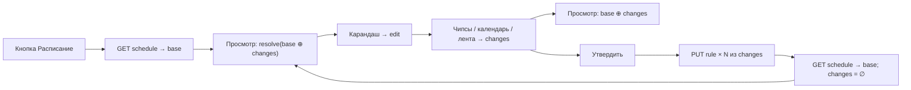

# Phase 7j — UI расписания соединения (модалка)

**Статус:** целевая модель для оживления UI (base с бэка + локальные changes).  
**Точка входа:** полоса «Связь» → кнопка **Расписание** → модалка `ConnectionSchedulePopover`  
(`services/online-history-server/web/src/ui/components/ConnectionSchedulePopover.tsx`).  
Доменные решения слоёв / SCD-2 — [v2-exceptions.md](v2-exceptions.md).

Документ описывает, **как UI мыслит данные**, какие интерфейсы уже есть на фронте, и как бэк должен
кормить просмотр / принимать утверждение. Цель — прикрутить реальное **действующее** расписание
(`[base]`) и поверх него локальные правки (`[changes]`).

---

## 1. Картина слоёв

```
[base]     ← живые правила с бэка (GET …/schedule). Только чтение.
[changes]  ← черновик в модалке: слои, которые пользователь наредактировал.
             Пока не утверждены — на бэке их нет.

Просмотр:  resolve(base ⊕ changes)   — агрегат «как будет»
Редакт.:   авторство changes (main / regular / static)
Утвердить: changes → бэк (upsert), бэк вшивает в base (SCD-2)
```

Приоритет при резолве дня/даты (и на UI, и на бэке):

```
static (date)  >  regular (dow)  >  main
```

Внутри одного tier на бэке побеждает свежесть (`effectiveFrom`). На UI-черновике внутри
`ScheduleLayerDict` порядок массива = снизу вверх; «верхний покрывающий» побеждает
(`resolveLayerForDow` / `resolveLayerForDate`).

---

## 2. Режимы модалки

| Режим | Как включается | Что видно | Что можно |
|-------|----------------|-----------|-----------|
| **Просмотр** | глаз (Eye), по умолчанию если на бэке уже есть rules | агрегат base (+ changes, если есть) | клик по колбаске → выбрать слой для фокуса; маркеры ленты залочены |
| **Редактирование** | карандаш (Pencil); если rules пусты — сразу edit | тот же график + чипсы скоупа | менять окно, режим, шаблоны, слои; копить `changes` |
| **Просмотр (агрегат)** | чип **[Просмотр]** в edit | все слои яркие, без фокуса одного | маркеры / шаблоны / Утвердить заблокированы; «посмотри base⊕changes» |

Фокус слоя (не aggregate): подсвечены только дни/ленты **текущего** скоупа; остальные
приглушены (в т.ч. при выборе **main** / `[Все]`).

Чип **[Очистить]** — сбросить локальные слои (в целевой модели: очистить `changes`, base не трогать).

---

## 3. Модель данных на фронте (черновик)

Источник: `web/src/core/scheduleLayerDict.ts`.

### 3.1. `ScheduleLayer` — один слой

```ts
type LayerMode = 'window' | 'off';

interface ScheduleLayer {
  /** Стабильный ключ UI: `main` | `dow:<mask>` | `date:<from>:<to>` */
  id: string;
  scopeKind: 'main' | 'dow' | 'date';
  dowMask: number | null;      // только dow; иначе null
  dateFrom: string | null;     // ISO yyyy-MM-dd; только date
  dateTo: string | null;
  label: string;               // «Все» | «Будни» | «Сб, Вс» | «Пн» | «05.07–07.07» …
  mode: LayerMode;
  /** Минуты от 00:00 дня открытия; endMin = startMin + duration (может > 1440). */
  startMin: number;
  endMin: number;
}
```

Окно на UI хранится как **абсолютные минуты оси** (`startMin`/`endMin`), не как `HH:mm`+duration.
При отправке на бэк конвертируется: `open = HH:mm:ss`, `durationMin = endMin - startMin`
(1..1439).

### 3.2. `ScheduleLayerDict` — стек слоёв

```ts
interface ScheduleLayerDict {
  /** null = main не задан (можно жить на одних исключениях). */
  main: ScheduleLayer | null;
  /** Periodical (dow): group снизу, single сверху (`normalizeRegularExc`). */
  exc: ScheduleLayer[];
  /** Static (date), снизу вверх; поверх periodical. */
  staticExc: ScheduleLayer[];
}
```

Целевое разделение в стейте модалки:

| Поле | Смысл |
|------|--------|
| `base: ScheduleLayerDict` | `dictFromRules(state.rules)` — снимок с бэка, immutable в сессии edit |
| `changes: ScheduleLayerDict` | локальный черновик (то, что сейчас в коде часто зовётся `layers`) |
| эффективный словарь | `merge(base, changes)` — для графика / «Просмотр» |

**Сейчас (gap):** при открытии `layers = dictFromRules(rules)` — base и changes не разделены;
«Утвердить» шлёт **одно** активное правило (`PUT …/rule`), а не пачку changes.

### 3.3. Маска дней (`dowMask`)

Биты (совпадают с бэком `ConnectionScheduleDow`):

| День | JS `Date.getDay()` | Бит | Значение |
|------|--------------------|-----|----------|
| Пн | 1 | 1 | 1 |
| Вт | 2 | 2 | 2 |
| Ср | 3 | 4 | 4 |
| Чт | 4 | 8 | 8 |
| Пт | 5 | 16 | 16 |
| Сб | 6 | 32 | 32 |
| Вс | 0 | 64 | 64 |

Группы UI:

- **Будни** = `31` (`MASK_WEEKDAYS`)
- **Сб, Вс** = `96` (`MASK_WEEKEND`)
- XOR: одновременно жива только одна group-маска
- Single-день = один бит; Ctrl/Cmd — несколько singles (отдельные слои `dow:<bit>`)

### 3.4. Резолв для отрисовки

```ts
resolveLayerForDow(dict, jsDay)   // main → перекрывающие exc (без static)
resolveLayerForDate(dict, iso)    // … → перекрывающие staticExc
```

Tetris-ленты под графиком:

- periodical: `regularBoardSlots(dict, jsDay)` — этаж 0 всегда main (даже `null` = серый слот)
- static: `staticBoardSlots(dict, iso)` — только date-слои, без main

---

## 4. Контракт с бэком (DTO / API)

Источник типов: `web/src/core/types.ts`. Клиент: `OhsApi` в `web/src/core/api.ts`.

### 4.1. `GET /api/connections/{id}/schedule` → `[base]`

Ответ — **действующее** состояние (живые правила, `effective_to IS NULL`):

```ts
interface ConnectionScheduleStateDto {
  settings: ConnectionScheduleSettingsDto;
  rules: ConnectionScheduleRuleDto[];   // ← это [base]
}

interface ConnectionScheduleSettingsDto {
  connectionId: number;
  autoEnabled: boolean;   // Auto on/off (не строка-правило)
  engine: string;         // ведущий календарь, напр. futures
  tz: string;             // Europe/Moscow
}

interface ConnectionScheduleRuleDto {
  scheduleId: number;
  connectionId: number;
  scopeKind: 'main' | 'dow' | 'date' | string;
  dowMask: number | null;
  dateFrom: string | null;     // yyyy-MM-dd
  dateTo: string | null;
  mode: 'window' | 'off' | string;
  open: string | null;         // "HH:mm:ss" при mode=window
  durationMin: number | null;  // 1..1439
  end: string | null;          // производное для UI
  effectiveFrom: string;       // ISO timestamptz
  effectiveTo: string | null;  // null = живое
  closeReason: 'superseded' | 'canceled' | string | null;
  changeSource: string;
  changeNote: string | null;
}
```

Фронт: `dictFromRules(rules)` → `ScheduleLayerDict` для `[base]`.

Правила маппинга `RuleDto → ScheduleLayer`:

| DTO | Layer |
|-----|--------|
| `scopeKind` | то же |
| `dowMask` / `dateFrom`/`dateTo` | то же |
| `mode` | `window` \| `off` |
| `open` + `durationMin` | `startMin` = минуты из `open`; `endMin` = `startMin + durationMin` |
| — | `id` / `label` вычисляются на клиенте |

### 4.2. Утверждение `[changes]` → бэк

**Сейчас (реализовано):** на каждое утверждаемое правило —

```
PUT /api/connections/{id}/schedule/rule
```

тело:

```ts
interface PutConnectionScheduleRuleRequest {
  scopeKind: string;              // 'main' | 'dow' | 'date'
  dowMask?: number | null;
  dateFrom?: string | null;
  dateTo?: string | null;
  mode: string;                   // 'window' | 'off'
  open?: string | null;           // "HH:mm:ss", обяз. при window
  durationMin?: number | null;
  changeSource?: string;          // UI шлёт 'ui'
  changeNote?: string | null;
}
```

Бэк: SCD-2 upsert + авто-ретайр `Mold ⊆ M` того же уровня → `superseded`.  
Ответ: `ConnectionScheduleRuleDto` (новая живая версия).

**Целевое поведение UI:** кнопка **Утвердить** отправляет **все** слои из `changes`
(main + каждый exc + каждый staticExc), либо пачкой, либо серией PUT; после успеха —
перечитать `GET …/schedule` в `base`, обнулить `changes`.

Дополнительно уже есть:

| Метод | Назначение |
|-------|------------|
| `PUT …/schedule/settings` | Auto / engine / tz |
| `POST …/schedule/rules/{scheduleId}/cancel` | soft-cancel живого правила base |
| `GET …/schedule/history` | история (закрытые + живые) для блока «История» |

### 4.3. Пример тел PUT

Main (окно):

```json
{
  "scopeKind": "main",
  "mode": "window",
  "open": "06:00:00",
  "durationMin": 1140,
  "changeSource": "ui",
  "changeNote": null
}
```

Regular weekend:

```json
{
  "scopeKind": "dow",
  "dowMask": 96,
  "mode": "window",
  "open": "08:50:00",
  "durationMin": 670,
  "changeSource": "ui"
}
```

Static off на диапазон:

```json
{
  "scopeKind": "date",
  "dateFrom": "2026-07-05",
  "dateTo": "2026-07-07",
  "mode": "off",
  "changeSource": "ui",
  "changeNote": "техработы"
}
```

---

## 5. Поток UI (целевой)



### 5.1. Открытие

1. `ConnectionLane` держит `connectionSchedule$` (уже загруженный state или fetch).
2. Поповер получает `state: ConnectionScheduleStateDto | undefined`.
3. `base = dictFromRules(state.rules)`; `changes = empty` (или восстановленный черновик сессии).
4. Режим: rules пусты → сразу edit; иначе просмотр.

### 5.2. Редактирование → `changes`

| UI | Пишет в |
|----|---------|
| `[Все]` | `changes.main` (создать / снять / выбрать) |
| `[Будни]` / `[Сб, Вс]` | `changes.exc` group (XOR) |
| `[Пн]`…`[Вс]` | `changes.exc` single; Ctrl — несколько |
| Календарь дат | `changes.staticExc` |
| Лента окна / режим / шаблон MOEX | патч **активного** слоя в changes |
| Клик колбаски дня | `selectLayer(resolve(…))` — фокус скоупа |

Локальная память окон по `layer.id` (round-trip при снятии/возврате чипа) — только UI,
на бэк не уходит.

### 5.3. Просмотр агрегата

Эффективный словарь = overlay:

- если в `changes` задан `main` → он заменяет `base.main` (в т.ч. `null` = снять main локально);
- `exc` / `staticExc`: слои changes с тем же `id` заменяют base; новые id добавляются сверху;
- удаление слоя в changes (повторный клик чипа) — в агрегате слой base снова виден, **пока**
  не утвердили cancel на бэке (уточнить UX cancel vs «убрать из changes»).

График недели/дат и tetris строятся из эффективного словаря через `resolveLayer*`.

### 5.4. Утвердить

1. Подтверждение («Утвердить правило …» → в целевой модели лучше «Утвердить N изменений»).
2. Для каждого слоя в `changes` — `PutConnectionScheduleRuleRequest` (как §4.2).
3. Multi-singles (несколько дней без group-маски) → отдельный PUT на каждый бит (уже так).
4. Успех → reload base, `changes = ∅`, закрыть или остаться в просмотре.

Снятие правила **из base** (не из черновика) — `POST …/cancel` по `scheduleId`
(нужна связь `ScheduleLayer` ↔ `scheduleId` из DTO; в чистом layer id её нет — хранить
map `id → scheduleId` из base).

---

## 6. Что бэку нужно для прикрутки

Минимальный контракт уже есть и совпадает с UI:

1. **`GET …/schedule`** всегда отдаёт полный `[base]`: settings + все живые rules
   (`main` ≤1, любые `dow`/`date`). Пустой список — валидно.
2. **`PUT …/rule`** принимает те же `scopeKind` / маски / даты / `open`+`durationMin`, что шлёт
   поповер; SCD-2 и ⊆-ретайр — ответственность бэка (UI не шлёт `scheduleId` на upsert).
3. Производное поле **`end`** в DTO желательно оставлять — история и отладка.
4. После серии upsert — клиент делает **повторный GET** (или бэк возвращает полный state —
   удобнее для UI, пока не обязательно).
5. **`cancel`** по `scheduleId` для отмены живого base-правила из UI (когда появится явная
   кнопка отмены слоя base).

Опционально (улучшение контракта под пачку changes):

```
PUT /api/connections/{id}/schedule/changes
body: { rules: PutConnectionScheduleRuleRequest[] }
→ ConnectionScheduleStateDto
```

Пока UI может эмулировать циклом существующих PUT.

---

## 7. Файлы

| Роль | Путь |
|------|------|
| Модалка | `web/src/ui/components/ConnectionSchedulePopover.tsx` |
| Открытие | `web/src/ui/components/ConnectionLane.tsx` |
| Словарь слоёв | `web/src/core/scheduleLayerDict.ts` |
| Резолвер по DTO (фаза на карточке) | `web/src/core/connectionSchedule.ts` |
| DTO / API | `web/src/core/types.ts`, `web/src/core/api.ts` |
| Store | `web/src/core/OhsStore.ts` (`upsertConnectionScheduleRule`, …) |
| Домен бэка | см. [v2-exceptions.md](v2-exceptions.md) |

---

## 8. Следующий шаг реализации (фронт)

1. Развести в поповере `base` и `changes` (сейчас одно поле `layers`).
2. График / Просмотр = `merge(base, changes)`.
3. Edit пишет только в `changes`; base не мутировать.
4. Утвердить = flush всех changes + reload base.
5. Очистить = `changes = empty` (base остаётся).
