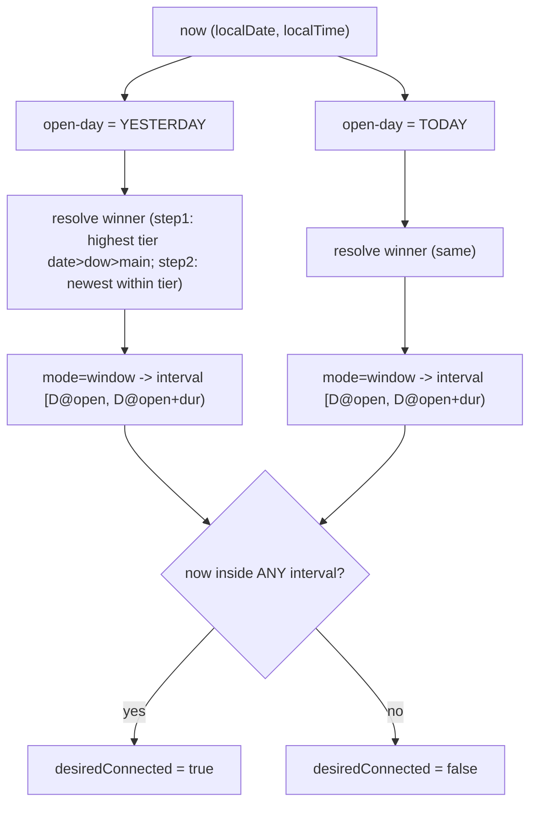

# Phase 7j v2 — Якорная модель + слоистые исключения (Connection schedule)

**Статус:** `DONE` (v1 UI dow/exceptions), **обновлено:** 2026-07-19.
Развитие MVP из [plan.md](plan.md) / [apply.md](apply.md): одно окно суток заменено на слоистые
правила со SCD-2. Контекст решений — эта заметка; статус — [report.md](report.md).

## Зачем переделали v1

MVP хранил **одно** окно суток на соединение (`window_start`/`window_end`, `mode` in-place). Реальная
эксплуатация требует разное расписание для будней/выходных/отдельных дней, при этом:

- «Утвердить» перетирал единственное окно — нельзя держать «основное + исключение на выходные»;
- окно через полночь (`end < start`) двусмысленно относилось к календарному дню (чей это торговый
  день — вчерашний или сегодняшний?);
- нет журнала «какие исключения живы» и наглядного недельного обзора.

## Итоговые решения

- **Якорь = день открытия сессии.** Окно принадлежит дню своего `open`; хвост «вытекает» за полночь
  как часть той же сессии. Исключение адресует сессию → скоуп (`dow`/`date`) означает **день open**.
- **Хранение окна:** `open_time TIME` + `duration_min INT` (1..1439, delta < 24ч, два маркера).
  `end` — производное, только в DTO/ленте. Уходит двусмысленность `24:00/00:00`.
- **Уровни приоритета:** `date` > `dow` > `main`, т.е. **основное < регулярное исключение (`dow`) <
  статическое исключение (`date`)**. Скоуп = день open. Более высокий уровень всегда бьёт нижний,
  независимо от возраста правила.
- **Внутри одного уровня:** побеждает **свежесть** (`effective_from` DESC, «refresh priority»).
  Специфичность (узость маски) не вводим («свежесть решает, узость — удивляет»).
- **Авто-ретайр:** при upsert правила с маской `M` любое живое правило того же уровня с маской
  `Mold ⊆ M` (полностью перекрыто) система закрывает как `superseded`. Между уровнями не ретайрим.
- **Soft-cancel:** снятие правила = закрыть SCD-2 с `close_reason='canceled'` (fallback на нижний
  уровень / `main` / нет сессии).
- **Режим правила:** `mode` = `window` | `off` (нерабочий период). `main` тоже может быть `off`.
- **`main` необязателен:** можно жить на одних исключениях; день без правил → не подключаемся (без ошибки).
- **Auto (вкл/выкл), engine, tz — на уровне соединения** (`connection_schedule_settings`), не на строке-правиле.
- **Отмена — по строке-правилу** (дорожки в overview), не по чипсу. Чипсы = авторинг скоупа.
- **Пресеты — только информативные** подсказки редактора, на логику не влияют.

## Модель разрешения (чистая функция)

Для момента `now` (в tz соединения) кандидаты — дни открытия `{вчера, сегодня}` (duration < 24ч):



`tradingDay`-гейт (`IMarketCalendar` / `engine`) применяется к **дню открытия** только для `main`;
исключения (`dow`/`date`) торговый день переопределяют (могут форсить `window` в праздник или `off`).

### Разбор ключевых кейсов

- **Овернайт-хвост.** Пятничная сессия `22:00 + 240 мин` = до `02:00` субботы принадлежит пятнице.
  В субботу `00:30` подключены (через open-day = пятница), в `03:00` — нет. Субботний `date-off`
  пятничный хвост НЕ отменяет.
- **Свежесть внутри уровня.** Живут `dow{Сб,Вс} 10:00–19:00` и более свежее `dow{Сб} 14:00–19:00`.
  Суббота → 14:00–19:00 (свежее бьёт), воскресенье → 10:00–19:00 («выходные» покрывают Вс).
- **Узкое над широким.** Постановка `{Сб}` поверх живого `{Сб,Вс}` НЕ ретайрит `{Сб,Вс}`
  (`weekend ⊄ {Сб}`), оба живы; в субботу выигрывает свежее по правилу свежести.
- **Приоритет уровней.** `date-off` на субботу бьёт `dow{выходные}`, даже будучи старше.

## Схема БД (V024, пересоздание — production нет)

`db/migrations/V024__connection_schedule_rebuild.sql`: `DROP TABLE connection_schedule` +
пересоздание в две таблицы.

**`connection_schedule_settings`** (уровень соединения):

```sql
connection_id  BIGINT  PK → connector_connection
auto_enabled   BOOLEAN NOT NULL DEFAULT FALSE   -- бывший mode manual|scheduled
engine         TEXT    NOT NULL DEFAULT 'futures'
tz             TEXT    NOT NULL DEFAULT 'Europe/Moscow'
updated_at     TIMESTAMPTZ NOT NULL DEFAULT now()
```

**`connection_schedule`** (слоистые правила, SCD-2):

```sql
schedule_id    BIGINT PK (identity)
connection_id  BIGINT NOT NULL → connector_connection
scope_kind     TEXT   CHECK (scope_kind IN ('main','dow','date'))
dow_mask       SMALLINT NULL  -- для dow, 1..127; Пн=1,Вт=2,Ср=4,Чт=8,Пт=16,Сб=32,Вс=64
date_from      DATE NULL      -- для date (v2)
date_to        DATE NULL
mode           TEXT   CHECK (mode IN ('window','off'))
open_time      TIME NULL      -- обяз. при mode='window'
duration_min   INT  NULL CHECK (duration_min BETWEEN 1 AND 1439)
effective_from TIMESTAMPTZ NOT NULL
effective_to   TIMESTAMPTZ NULL          -- NULL = живое правило
close_reason   TEXT NULL CHECK (close_reason IN ('superseded','canceled'))
change_source  TEXT NOT NULL
change_note    TEXT NULL
-- CHECK: window ⇒ open+duration заданы; scope согласован с payload (main без масок, dow с маской,
--        date с диапазоном date_to>=date_from)
```

Индексы: частичный UNIQUE живого `main` (`WHERE effective_to IS NULL AND scope_kind='main'`),
`(connection_id) WHERE effective_to IS NULL` (грузит резолвер), `(connection_id, effective_from DESC)`.

v1-UI наполняет `scope_kind IN ('main','dow')`; `date_*` заведены под v2 без смены схемы.

## Бэкенд

### Домен (`Scinverse.Ohs.Domain`)

- `ConnectionScheduleRule` (scope/mask/date/mode/open/duration/SCD-2), `ConnectionScheduleSettings`,
  `ConnectionScheduleState` (settings + живые правила). Заменил прежний `ConnectionScheduleEntry`.
- Константы `ConnectionScheduleScopes` (+ `Tier()`), `…RuleModes`, `…CloseReasons`,
  `ConnectionScheduleDow` (`Bit`, `Contains`, `IsSubset`, `Weekdays=31`, `Weekend=96`).
- **`ConnectionScheduleResolver`** — чистая функция: `IsConnectDesired`, `ResolveSession`,
  `ResolveWinner`, `Covers`. Прежний `ConnectionScheduleWindow.Contains` оставлен (не используется
  супервизором, но покрыт unit-тестами).

### Стор (`IConnectionScheduleStore` / `ConnectionScheduleStore`)

- `GetState` / `GetSettings` (дефолт, если строки нет) / `ListLiveRules` / `ListHistory`.
- `ListAutoEnabled` — состояния соединений с `auto_enabled` для супервизора.
- `UpsertRule` — валидация + SCD-2: закрыть живые того же уровня с `Mold ⊆ M` как `superseded`
  (для dow — `(dow_mask & @mask)=dow_mask`; date — вложение диапазона; main — единственный) + INSERT.
  Возвращает `UpsertRuleResult(Rule, SupersededIds)`.
- `CancelRule` — закрыть живую версию как `canceled` (повторный cancel → null).
- `SetSettings` (coalesce) / `SetAuto` (upsert строки настроек).

### Супервизор (`ConnectionSupervisor`)

Вместо `Contains` по одной строке грузит `ListAutoEnabled` и для каждого соединения зовёт
`ConnectionScheduleResolver.IsConnectDesired` по живым правилам. `tradingDay` предвычисляется для
дней открытия `{вчера, сегодня}` и передаётся в резолвер делегатом. Retry ×5 / анти-DDoS / notify —
как в v1.

### API / DTO

| Метод | Назначение |
|-------|------------|
| `GET /api/connections/{id}/schedule` | state: `settings` + живые `rules` (с производным `end`). Всегда 200 (дефолтные настройки, пустой список). |
| `GET …/schedule/history` | полная история правил |
| `PUT …/schedule/rule` | upsert правила (SCD-2 + авто-ретайр). Тело `PutConnectionScheduleRuleRequest` |
| `PUT …/schedule/settings` | Auto / engine / tz (`PutConnectionScheduleSettingsRequest`) |
| `POST …/schedule/rules/{scheduleId}/cancel` | soft-cancel правила |

Ручной `POST …/disconnect` → `SetAuto(false)`. DTO: `ConnectionScheduleRuleDto`,
`ConnectionScheduleSettingsDto`, `ConnectionScheduleStateDto`.

### Уведомления

- `connection.schedule.rule_set` (info, source `user`) — правило утверждено;
- `connection.schedule.rule_superseded` (info, source `system`) — сколько живых перекрыто;
- `connection.schedule.rule_canceled` (info, source `user`) — правило снято.

## Фронтенд

- `core/connectionSchedule.ts` — клиентское зеркало резолвера (`isConnectedNow`, `resolveWinnerForDow`,
  `resolveWinnerForDate`, `dowBit`, `hmsToMin`). Без торгового календаря (для подсказки фазы Auto).
- `ConnectionSchedulePopover.tsx` — авторинг **скоупа** (чипсы `Все`=main / `Будни` / `Сб,Вс` /
  отдельные дни), режим `Окно связи | Выключено`, окно = `open+duration` на ленте 48ч; «Утвердить» =
  upsert правила. Пресеты `market_schedule` — информативные подсказки. История.
- `WeeklyScheduleOverview.tsx` (+ css) — read-only обзор: строка дней Пн..Вс (эффективно, с учётом
  приоритетов) + дорожки живых правил с кнопкой «снять» + предпросмотр текущей правки.
- `core/api.ts`, `core/types.ts` — методы `getConnectionSchedule` / `putConnectionScheduleRule` /
  `putConnectionScheduleSettings` / `cancelConnectionScheduleRule`; типы правил/настроек/состояния.
- `OhsStore` — `connectionSchedule$: Map<id, ConnectionScheduleStateDto>`;
  `setConnectionAuto` / `upsertConnectionScheduleRule` / `cancelConnectionScheduleRule` /
  `refreshConnectionSchedule`.
- `ConnectionLane.tsx` — Auto доступен при наличии ≥1 живого правила; фаза «в окне» — через `isConnectedNow`.

## Тесты

- `ConnectionScheduleResolverTests` (9): приоритеты `date>dow>main`, свежесть внутри уровня,
  овернайт-хвост по дню открытия, `main` в неторговый день, `off`, `main=null` (нет правил),
  пятничный хвост vs субботний off.
- `ConnectionScheduleStoreTests` (6, Testcontainers + V024): SCD-2 upsert main, авто-ретайр
  `Mold ⊆ M` (superseded), узкое-над-широким (широкое живо), soft-cancel + повторный cancel=null,
  settings default/auto listing, `off`-правило без окна.
- Прогоны: unit **131 ✓**, integration **43 ✓**, web (vitest) **27 ✓**.

## Приёмка (dev, synthetic id=1)

- V024 применена мигратором (`Upgrade successful`); `GET …/schedule` отвечает новой схемой
  (`settings + rules`).
- Смоук: `PUT rule` main `07:00 +720` → `end 19:00`; `PUT rule` dow `weekend(96) 10:00 +540` → `end 19:00`;
  оба живы; `cancel` обоих → пустой список. Тестовые данные сняты (чистый слейт).

## Не в области (v1-UI)

- Авторинг `date`-исключений в UI (колонки `date_*` и резолвер уже готовы) — v2 фронт.
- Join календарей рынков; `changed_by` (phase 10).
