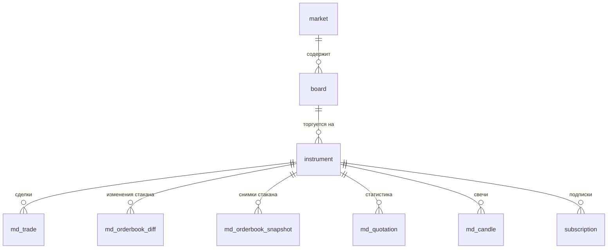
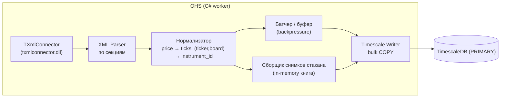

# OHS — Online History Server

> Базовая документация. Часть системы **Scinverse**.
> Стартовый сервис проекта: первый работающий вертикальный срез (коннектор → нормализация → хранилище → визуализация).

---

## 1. Назначение

**OHS (Online History Server)** — постоянно работающий сервис на **C# / .NET**, который:

- подключается к брокерскому/биржевому каналу через коннектор (первый — **TRANSAQ Connector** от Finam, далее `Plaza2`, `QUIK`);
- в онлайн-режиме принимает поток рыночных данных (лента сделок, стакан, котировки);
- нормализует «сырьё» коннектора в единую **каноническую модель события**;
- надёжно и плотно сохраняет историю в **TimescaleDB** (с использованием подхода QScalp к упаковке);
- отдаёт наружу два вида доступа: **исторический запрос** и **live-поток** для фронтенда;
- показывает состояние: список подключённых инструментов, гэпы, лаг записи.

OHS относится к **🔵 холодному контуру** системы: оптимизирован под пропускную способность и надёжность записи, не участвует в принятии торговых решений. Пишет **только в PRIMARY**; читатели (Python, фронт) работают через **READ-ONLY реплику**.

---

## 2. Первый шаг (MVP)

> Приложение подключается через TRANSAQ, собирает рыночные данные и сохраняет их в БД в реальном времени.

Границы MVP:

- один коннектор — TRANSAQ (`txmlconnector.dll`, обмен XML-командами и XML-callback'ами);
- сохраняем три рыночных потока: **лента всех сделок**, **стакан**, **котировки** (+ справочник инструментов);
- цель — непрерывный сбор и плотное хранение; визуализация и API — следующий шаг.

---

## 3. Источник данных: TRANSAQ Connector

Коннектор — нативная DLL. Схема взаимодействия (из примера `connector.cs`):

- `Initialize(path, logLevel)` / `UnInitialize()` — старт/стоп библиотеки;
- `SetCallback(callback)` — регистрация функции обратного вызова; **все данные приходят асинхронно строками XML** в этот колбэк;
- `SendCommand(xml)` — отправка команд (`connect`, `subscribe`, `gethistorydata` и т.д.), ответ — тоже XML.

Данные разбираются как XML-фрагменты; верхнеуровневый тег определяет «секцию». Значимые для OHS секции:

| XML-секция | Что это | Куда сохраняем |
| :--- | :--- | :--- |
| `securities` | Справочник инструментов | `instrument` (+ `market`, `board`) |
| `pits` / `boards` / `markets` | Торговые площадки, режимы, рынки | `market`, `board` |
| `alltrades` | Лента всех обезличенных сделок (тики) | `md_trade` |
| `quotes` | Изменения стакана по ценовым уровням | `md_orderbook_diff` (+ снимки) |
| `quotations` | Рыночная статистика по инструменту | `md_quotation` |
| `candles` | Готовые свечи (по запросу) | `md_candle` (опционально) |
| `server_status` | Статус соединения | `ingest_session` / health |

### 3.1. Поля ключевых секций

**`alltrades` → сделка (тик):**

| Поле TRANSAQ | Тип | Смысл |
| :--- | :--- | :--- |
| `secid` / `board` / `seccode` | — | идентификация инструмента |
| `tradeno` | long | биржевой номер сделки (ключ дедупликации) |
| `time` | datetime | время сделки |
| `price` | decimal | цена |
| `quantity` | int | объём в лотах |
| `buysell` | B/S | направление инициатора |
| `openinterest` | long | открытый интерес (FORTS) |

**`quotes` → изменение уровня стакана:**

| Поле TRANSAQ | Тип | Смысл |
| :--- | :--- | :--- |
| `secid` / `board` / `seccode` | — | инструмент |
| `price` | decimal | цена уровня |
| `buy` | int | лотов на покупку (бид) на этом уровне; `-1` — уровень снят |
| `sell` | int | лотов на продажу (аск) на этом уровне |
| `source` / `yield` | — | источник / доходность (для облигаций) |

> Это ровно инкрементальная модель: приходит не весь стакан, а только изменившиеся уровни. Совпадает с подходом QScalp (`QuotesStream` — запись только diff'ов).

**`quotations` → рыночная статистика** (много полей; ключевые): `last`, `quantity`, `bid`, `offer`, `numbids`, `numoffers`, `open`, `high`, `low`, `open_interest`, `voltoday`, `valtoday`, `change`, `yield`.

**`securities` → инструмент:** `secid`, `seccode`, `board`, `market`, `shortname`, `decimals`, `minstep`, `lotsize`, `point_cost`, `sectype`, `quotestype`.

> ⚠️ `secid` в TRANSAQ **не стабилен между сессиями** — как ключ инструмента использовать пару **(`seccode`, `board`)**, а `secid` хранить как атрибут текущей сессии.

---

## 4. Подход к хранению: уроки QScalp

Формат **QSH** (QScalp History) — это эталон плотного хранения биржевого микроструктурного потока. Ключевые приёмы (подтверждены кодом `DataWriter`, `OrdLogStream`, `QuotesStream`, `DealsStream`):

1. **Цена как целое число шагов** (`price_ticks = round(price / min_step)`). Хранится `int`/`bigint`, а не `double`. Реальная цена = `price_ticks × min_step`. Резко уменьшает разброс значений и улучшает сжатие.
2. **Дельта-кодирование**: каждое поле пишется как разница от предыдущего значения (`price − lastPrice`, `dealId` растущим смещением и т.д.).
3. **Флаги присутствия полей**: перед записью — байт флагов, какие поля изменились; неизменные поля не пишутся вовсе.
4. **Varint (LEB128 / ULEB128)**: переменная длина целых — малые дельты занимают 1 байт.
5. **«Растущие» значения** (`WriteGrowing`) для монотонных величин: время в мс, `tradeno`, `dealId`.
6. **Стакан — только diff'ы** + периодическая реконструкция; знак объёма кодирует сторону (бид `>0`, аск `<0`), `0` — снятие уровня.
7. Поверх всего — **GZip/Deflate**.

### Как переносим это в TimescaleDB

Мы не пишем свой бинарный формат — мы **воспроизводим те же принципы средствами TimescaleDB**, оставляя данные SQL-запрашиваемыми:

| Приём QScalp | Реализация в TimescaleDB |
| :--- | :--- |
| Цена в шагах (`int`) | колонка `price_ticks BIGINT` (+ `min_step` в справочнике) |
| Дельта + varint по времени/цене | нативное **columnar compression** (delta-of-delta для времени, delta для цены) — по сути тот же алгоритм |
| Группировка по инструменту | `segmentby = instrument_id` в политике сжатия |
| Порядок для дельт | `orderby = ts` (и `seq`) |
| Стакан diff'ами | таблица инкрементов `md_orderbook_diff` + периодические снимки |
| GZip файла | сжатие чанков TimescaleDB (до ~90%) |

> Итог: на диске плотность, близкая к QSH, но с полноценным SQL, партиционированием по времени и репликацией.
>
> **Альтернатива (на будущее, для FORTS/Plaza2):** если появится полный **OrderLog** (журнал заявок биржи), из которого QScalp реконструирует и стакан, и ленту, — хранить его в отдельной hypertable `md_ordlog` (флаги + дельты), а стакан/ленту строить на лету. TRANSAQ полный OrderLog не отдаёт, поэтому в MVP работаем с `alltrades` + `quotes`.

---

## 5. Схема БД

### 5.1. Справочники (обычные таблицы)

```
market
  market_id      INT           PK          -- id рынка TRANSAQ
  name           TEXT

board
  board_id       TEXT          PK          -- код режима торгов (TQBR, FUT, ...)
  market_id      INT           FK → market
  name           TEXT

instrument
  instrument_id  BIGSERIAL     PK          -- внутренний стабильный ключ
  ticker         TEXT          NOT NULL    -- сокращённый код / TRANSAQ seccode (часть стабильного ключа)
  board_id       TEXT          FK → board
  market_id      INT           FK → market
  transaq_secid  INT                       -- secid текущей сессии (нестабилен)
  short_name     TEXT
  name           TEXT
  sec_type       TEXT                      -- SHARE / FUT / OPT / BOND / CURRENCY
  decimals       SMALLINT                  -- знаков после запятой
  min_step       NUMERIC       NOT NULL    -- шаг цены (для price_ticks ↔ price)
  lot_size       INT
  point_cost     NUMERIC                   -- стоимость шага цены
  currency       TEXT
  active         BOOLEAN       DEFAULT true
  first_seen_at  TIMESTAMPTZ
  last_seen_at   TIMESTAMPTZ
  UNIQUE (ticker, board_id)
```

### 5.2. Рыночные данные (hypertables, партиции по `ts`)

```
md_trade                         -- лента всех сделок (alltrades) — базовый поток
  ts             TIMESTAMPTZ   NOT NULL    -- время сделки (биржевое)
  instrument_id  BIGINT        NOT NULL
  trade_no       BIGINT        NOT NULL    -- биржевой номер (дедупликация)
  price_ticks    BIGINT        NOT NULL
  quantity       INT           NOT NULL    -- лоты
  side           SMALLINT      NOT NULL    -- +1 = buy(инициатор), -1 = sell
  open_interest  BIGINT                    -- FORTS, NULL для остального
  ingest_ts      TIMESTAMPTZ   DEFAULT now()
  PRIMARY KEY (instrument_id, trade_no, ts)
  -- hypertable: partition by ts; compress segmentby instrument_id, orderby ts

md_orderbook_diff                -- изменения стакана (quotes), инкрементально
  ts             TIMESTAMPTZ   NOT NULL
  instrument_id  BIGINT        NOT NULL
  seq            BIGINT        NOT NULL    -- монотонный счётчик обновлений в инструменте
  price_ticks    BIGINT        NOT NULL
  volume         INT           NOT NULL    -- >0 бид, <0 аск, 0 — уровень снят
  ingest_ts      TIMESTAMPTZ   DEFAULT now()
  PRIMARY KEY (instrument_id, seq, price_ticks)
  -- compress segmentby instrument_id, orderby ts

md_orderbook_snapshot            -- периодические полные снимки для быстрой реконструкции
  ts             TIMESTAMPTZ   NOT NULL
  instrument_id  BIGINT        NOT NULL
  snapshot_id    BIGINT        NOT NULL
  prices_ticks   BIGINT[]      NOT NULL    -- выровненные массивы уровней
  volumes        INT[]         NOT NULL    -- знак = сторона (как в diff)
  reason         SMALLINT                  -- 0 session_start / 1 periodic / 2 gap_recovery
  PRIMARY KEY (instrument_id, snapshot_id)

md_quotation                     -- рыночная статистика (quotations)
  ts             TIMESTAMPTZ   NOT NULL
  instrument_id  BIGINT        NOT NULL
  last_ticks     BIGINT
  last_qty       INT
  best_bid_ticks BIGINT
  best_ask_ticks BIGINT
  bid_depth      INT                       -- суммарный объём бидов
  ask_depth      INT
  open_ticks     BIGINT
  high_ticks     BIGINT
  low_ticks      BIGINT
  open_interest  BIGINT
  vol_today      BIGINT
  val_today      NUMERIC
  extra          JSONB                     -- прочие поля секции
  PRIMARY KEY (instrument_id, ts)

md_candle                        -- свечи (от TRANSAQ или строим сами)
  ts             TIMESTAMPTZ   NOT NULL    -- начало бара
  instrument_id  BIGINT        NOT NULL
  tf             SMALLINT      NOT NULL    -- таймфрейм (секунды/код)
  o_ticks        BIGINT
  h_ticks        BIGINT
  l_ticks        BIGINT
  c_ticks        BIGINT
  volume         BIGINT
  open_interest  BIGINT
  PRIMARY KEY (instrument_id, tf, ts)
```

### 5.3. Служебные таблицы

```
ingest_session                   -- сессии сбора данных
  session_id     BIGSERIAL     PK
  connector      TEXT                      -- 'transaq'
  started_at     TIMESTAMPTZ
  stopped_at     TIMESTAMPTZ
  status         TEXT                      -- running / stopped / error
  note           TEXT

subscription                     -- на что подписаны
  instrument_id  BIGINT        FK → instrument
  stream         TEXT                      -- trades / quotes / quotations
  enabled        BOOLEAN
  since          TIMESTAMPTZ
  PRIMARY KEY (instrument_id, stream)

data_gap                         -- обнаруженные разрывы
  gap_id         BIGSERIAL     PK
  instrument_id  BIGINT
  stream         TEXT
  gap_from       TIMESTAMPTZ
  gap_to         TIMESTAMPTZ
  detected_at    TIMESTAMPTZ
  recovered_at   TIMESTAMPTZ
  status         TEXT                      -- open / recovered / ignored
```

### 5.4. ER-обзор



---

## 6. Что именно сохраняем и как реконструируем

- **Лента сделок** (`md_trade`) — базовый поток; из него можно построить свечи любого таймфрейма (через continuous aggregates) и объёмный профиль.
- **Стакан** — храним компактно как **поток diff'ов** (`md_orderbook_diff`) + периодические **снимки** (`md_orderbook_snapshot`). Состояние стакана на момент `T` = ближайший снимок до `T` + применённые поверх diff'ы. Это прямой перенос модели QScalp на SQL.
- **Котировки** (`md_quotation`) — снапшоты рыночной статистики при изменении.
- **Цены везде — в шагах** (`*_ticks`); человекочитаемая цена вычисляется через `instrument.min_step` (удобно завернуть во VIEW).

---

## 7. Конвейер OHS (C#)



- **In-memory книга стакана** на инструмент нужна и для снимков, и для контроля целостности diff'ов.
- Запись — батчами через `COPY` (не построчный INSERT).

---

## 8. Нефункциональные требования

- **Идемпотентность**: сделки дедуплицируются по `(instrument_id, trade_no)`; при переподключении дубли не создаются.
- **Гэпы**: разрывы соединения фиксируются в `data_gap`; при возможности — докачка через `gethistorydata`.
- **Backpressure**: буфер + метрики отставания; приём не рушится при отставании БД.
- **Разделение записи/чтения**: пишем в PRIMARY, читатели — на реплике.
- **Observability**: лаг записи, объём потока по инструментам, состояние подписок (Prometheus/Grafana).

---

## 9. Дорожная карта OHS

1. Каркас коннектора TRANSAQ (connect / subscribe / callback), парсинг XML по секциям.
2. Справочник инструментов (`securities` → `instrument` / `market` / `board`).
3. Запись `md_trade` (alltrades) батчами в TimescaleDB. ✅ Первый непрерывный сбор.
4. Запись `md_orderbook_diff` + in-memory книга + периодические `md_orderbook_snapshot`.
5. `md_quotation`; политика сжатия и retention для hypertables.
6. Query/Replay API + минимальный фронт (список инструментов, стакан, лента, свечи).
7. Read-only реплика, continuous aggregates для свечей; докачка гэпов.

---

## 10. Ключевые абстракции C# (черновик)

### 10.1. Сервисные абстракции OHS

- `IMarketConnector` — connect/disconnect, subscribe(instrument, stream), событие сырых данных, статус.
- `ITransaqParser` — XML-фрагмент → доменные события (`TradeEvent`, `QuoteEvent`, `QuotationEvent`, `SecurityInfo`).
- `IInstrumentRegistry` — маппинг `(ticker, board)` ↔ `instrument_id`, `min_step`, конвертация `price ↔ ticks`.
- `IOrderBook` — in-memory книга: применение diff'ов, выдача снимка.
- `IHistoryWriter` — батчевая запись потоков в TimescaleDB (`COPY`).
- `ITimeframeAggregator` — подготовка серий по таймфреймам (`1m`, `5m`, `1H`, `1D`, …) на стороне СУБД (continuous aggregates) и индексация под запросы. Именно расширение роли сервера до «подготовки данных», а не только истории, — повод для рабочего имени **ODS (Online Data Server)** наряду с OHS.

### 10.2. Доменная модель данных (иерархия из legacy)

Берём проверенную иерархию из legacy (`TradingTypes`) как канонический слой данных для серий, свечей и футпринтов. Она естественно ложится и на хранение (раздел 5), и на выдачу в API, и на аналитику.

**Адаптация под Scinverse (обязательно):**
- Это **чистые DTO — без типов WPF** (`Brush`/`Pen`/`DrawingVisual`). Домен отделён от отрисовки (см. решение в `concept.md`).
- Цены — **в шагах** (`long`, `*_ticks`), как и в хранилище; человекочитаемый `double` вычисляется через `min_step`. (В legacy OHLC были `double` — здесь стандартизируем на ticks.)
- `ISeries<T>` = «поток/серия элементов инструмента» (в предложенной тобой нотации — `IDataSeries`); `IStockElement` можно назвать `IDateElement` (носитель времени).

```csharp
// Элемент с временем — корень иерархии
public interface IStockElement            // = IDateElement
{
    DateTime Date { get; set; }           // время (UTC)
}

// Бар / свеча
public interface IBar : IStockElement
{
    long OpenTicks  { get; set; }
    long HighTicks  { get; set; }
    long LowTicks   { get; set; }
    long CloseTicks { get; set; }
    long Volume     { get; set; }
    long OpenInterest { get; set; }       // FORTS
}

// Кластер футпринта — объём на одном ценовом уровне
public interface IClaster
{
    long PriceTicks { get; set; }
    long Volume     { get; set; }
    long BuyAmount  { get; set; }         // агрессор-покупатель
    long SellAmount { get; set; }         // агрессор-продавец
}

// Футпринт = бар + словарь кластеров по цене
public interface IFootprint : IBar
{
    // ключ = PriceTicks; строится из md_trade (цена, объём, направление)
    IReadOnlyDictionary<long, IClaster> Store { get; }
}

// Серия элементов инструмента (в legacy — ISeries<T>)
public interface IDataSeries<T> : IReadOnlyList<T> where T : IStockElement
{
    string Symbol    { get; set; }        // инструмент
    string Ticker    { get; set; }        // тикер / seccode
    string TimeFrame { get; }             // 1m, 5m, 1H, 1D, ...
    long   MinStepTicks { get; set; }     // шаг цены (в legacy — double Tick)
    int    Decimals  { get; set; }

    event Action IsChange;                // обновление серии

    bool IsBull(int i);
    bool IsBear(int i);
}

public interface IBarSeries       : IDataSeries<IBar>       { IBar       LastBar { get; set; } }
public interface IFootprintSeries : IDataSeries<IFootprint> { IFootprint LastBar { get; set; } }
```

**Связь со слоем хранения:**
- `IBarSeries` ↔ таблица `md_candle` (и continuous aggregates по таймфреймам).
- `IFootprintSeries` строится из `md_trade` (кластеры = группировка тиков по `price_ticks` с разбивкой buy/sell) — отдельно хранить не обязательно, это производный слой.
- `IOrderBook` (стакан) реконструируется из `md_orderbook_diff` + `md_orderbook_snapshot`.

