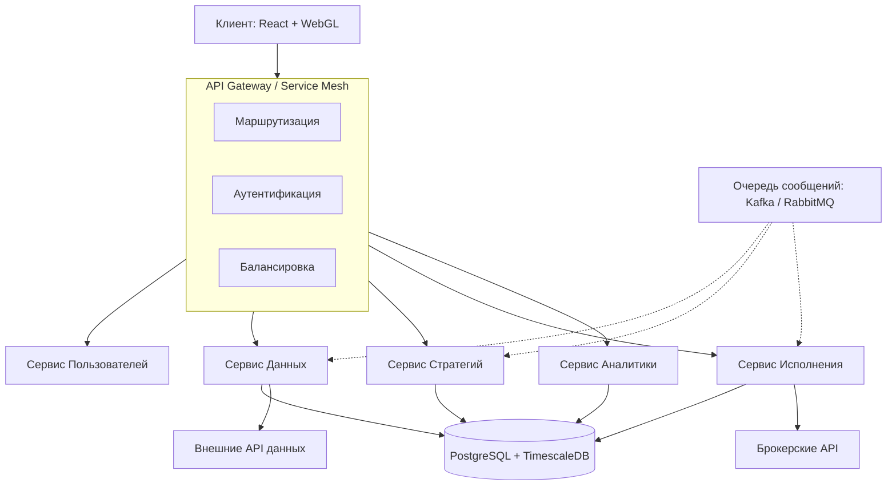

Хочу начать проектировать систему анализа и построения торговых систем. Опыт - WealthLab, BackTrader на Python и мультиброкер от Игоря Чечета.
Система будет представлять собой клиент-серверное приложение, коннекторы к брокерам и поставщикам данных, визуализация, аналитика торговля. 
Хочу подобрать стек технологий. Для визуализации - FrontEnd с React, webGL графикой. Серверная часть - думаю микросервисная архитектура с Python, C#. Базу хочу PosgressSQL.

### Общая архитектура

Микросервисная архитектура — отличный выбор для такой системы. Она позволит независимо разрабатывать, масштабировать и развертывать ключевые компоненты: сервис получения данных, сервис стратегий, сервис исполнения ордеров, сервис аналитики и т.д.

### Бэкенд: Python или C#?

В мире алгоритмической торговли это классический выбор, и оба языка имеют свои сильные стороны. Лучший подход — использовать синергию.

*   **C# для "ядра" и высоконагруженных частей**: C# — это основа LEAN Engine от QuantConnect — одного из самых продвинутых open-source движков для алгоритмической торговли . Он обеспечивает высочайшую производительность и надежность, что критично для обработки рыночных данных в реальном времени и управления ордерами. C# часто используется в institutional-grade системах именно благодаря своей скорости и строгой типизации .
*   **Python для исследований, анализа данных и быстрых прототипов**: Python — бесспорный король в Data Science. С его помощью ты сможешь быстро разрабатывать и тестировать новые торговые стратегии, используя знакомые тебе библиотеки вроде `Pandas` или `Polars` (кстати, `Polars` на порядки быстрее `Pandas` для больших данных ). Python идеально подходит для сервисов, где важна гибкость, а не сверхнизкая задержка .

Многие успешные проекты (включая Citigroup) используют именно эту комбинацию: Python для аналитики и стратегий, C# для высокопроизводительных микросервисов исполнения .

### База данных: PostgreSQL и не только

Твой выбор **PostgreSQL** — абсолютно верный. Это надежная и мощная СУБД. Для трейдинговой платформы критически важно правильно организовать хранение данных.

*   **Рекомендация: PostgreSQL + TimescaleDB**. Не используй "ванильный" PostgreSQL для хранения временных рядов (цен, объемов, стаканов). Установи расширение **TimescaleDB**, которое превращает PostgreSQL в полноценную базу данных для временных рядов. Оно дает:
    *   **Автоматическое партиционирование** по времени, что критически ускоряет запросы.
    *   **Сжатие данных** до 90%, экономя место .
    *   **Ускорение запросов в 1000+ раз** по сравнению с обычным PostgreSQL для типичных рыночных запросов .
*   **Мониторинг и observability**: Как и в любом финансовом приложении, критически важно видеть, что происходит внутри. Добавь в стек **Prometheus** для сбора метрик и **Grafana** для их визуализации. Для трассировки запросов между микросервисами можно использовать **Jaeger** .

### Визуализация (Frontend): React + WebGL

Графика — это лицо твоей системы, и здесь выбор библиотеки критически важен. Стандартные библиотеки вроде `chart.js` не подойдут.

Вместо того чтобы писать график с нуля на WebGL, обрати внимание на современные open-source решения. Например, библиотека `@mg-exchange/charts` показывает впечатляющую производительность (60fps при 100,000 свечей) за счет WebGL, работает с React и уже содержит огромное количество индикаторов и инструментов для рисования . Также есть `KLineChartQuant`, который ориентирован на работу с AI-агентами .

### Обмен сообщениями: Kafka

Для связи между микросервисами тебе понадобится надежная очередь сообщений. **Apache Kafka** — это отраслевой стандарт для финансовых систем . Она идеально подходит для:
*   **Потоковой передачи рыночных данных**.
*   **Асинхронной обработки ордеров**.
*   **Гарантированной доставки** событий между сервисами.

Вместо того чтобы писать все с нуля, можно обратить внимание на существующие архитектурные решения. Например, в одном из проектов использовалась архитектура Trading Engine Core, которая включает в себя все ключевые компоненты — от движка для обработки ордеров до PostgreSQL и интеграции с Kafka . Это может дать хорошую отправную точку и понимание того, как части системы взаимодействуют друг с другом.

### Резюмируя: рекомендации по стеку

| Компонент | Технология | Обоснование |
| :--- | :--- | :--- |
| **Языки** | **Python** (для стратегий, аналитики) + **C#** (для высоконагруженных сервисов) | Опыт с BackTrader плюс производительность и надежность C# для критических путей . |
| **База данных** | **PostgreSQL + TimescaleDB** | Мощная и надежная реляционная СУБД со сверхбыстрым расширением для временных рядов . |
| **API / Бэкенд** | **FastAPI** (Python), **ASP.NET Core** (C#), **API Gateway** (например, на Go) | Быстрые и современные фреймворки для создания микросервисов . |
| **Визуализация** | **React + WebGL** (рассмотри `@mg-exchange/charts`) | Высокая производительность, поддержка React и готовый функционал для трейдинга . |
| **Сообщения** | **Apache Kafka** | Стандарт для потоковой передачи данных и асинхронного обмена в финансовых системах . |
| **Мониторинг** | **Prometheus + Grafana + Jaeger** | Необходимы для наблюдения за состоянием и производительностью распределенной системы . |

У тебя отличная идея и правильное понимание технологий. Удачи в проектировании! Если появятся новые вопросы по мере проработки архитектуры — обращайся.
