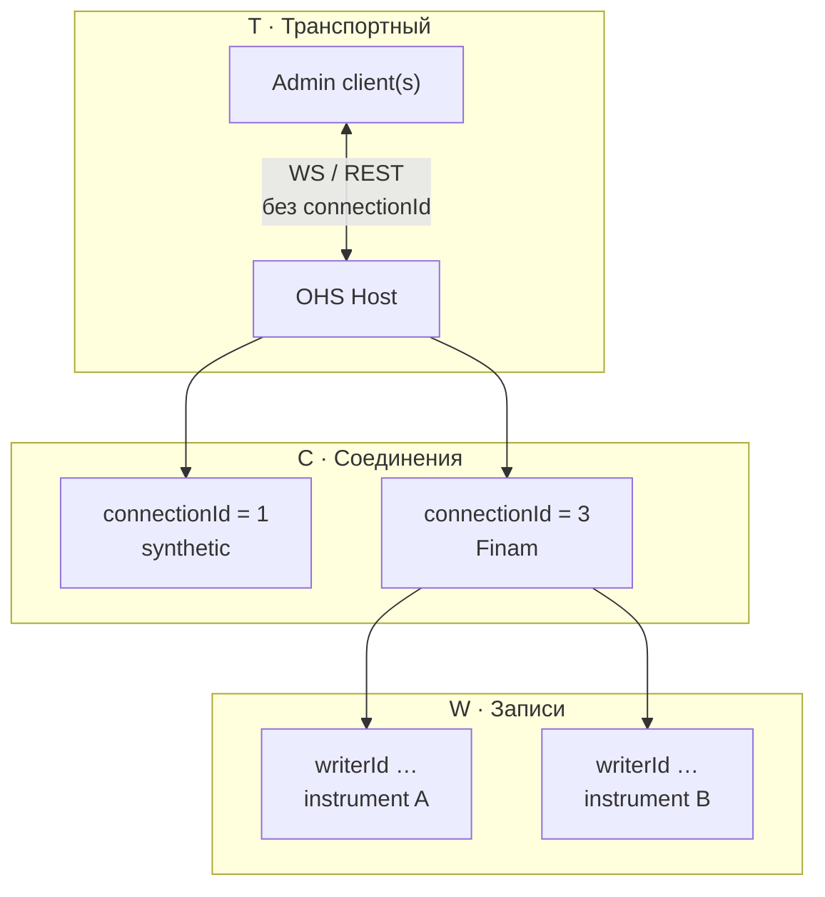
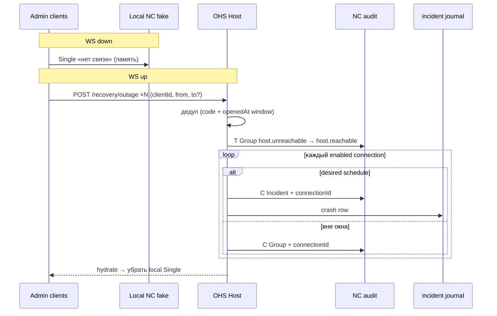

# Слои взаимодействия OHS

Плоская передача по сути **иерархической** структуры: admin ↔ Host ↔ connection ↔ запись.
В коде и в NC это выражено **слоями** — у каждого свой ключ, свой corr и свои правила журнала.

> Спека crash (транспорт + соединения): [`docs/dev/phase11/crash-dispatch.md`](../dev/phase11/crash-dispatch.md).  
> Инциденты / journal: [`incident.md`](incident.md) · [`incident-journal.md`](../dev/phase11/incident-journal.md).

---

## 1. Зачем слои

Один сбой Host затрагивает много сущностей. Без слоёв всё сваливается в один corr /
один `connectionId` (или `null`) — ломаются фильтр NC, гант и журнал.

Слой отвечает на вопрос: **о чём это уведомление / эпизод?**

| Вопрос | Слой |
|--------|------|
| Жив ли сервер OHS для админки? | **Transport** |
| Что с конкретным брокером / провайдером? | **Connections** |
| Что с потоком записи инструмента? | **Writers** |

---

## 2. Три слоя

| Слой | Имя | Ключ | Контекст | Journal `incident` | NC |
|------|-----|------|----------|--------------------|-----|
| **T** | **Транспортный** | нет entity-id | admin ↔ Host OHS (WS / control-plane) | **нет** | Group / Single без `connectionId` |
| **C** | **Соединения** | `connectionId` | провайдер / link к брокеру | только **Incident** (в горизонте) | Incident **или** Group на каждый id |
| **W** | **Записи** | `writerId` (+ связь с `connectionId`, `instrumentId`) | захват / покрытие инструмента | по правилам recording (отдельный контур) | атомы recording / coverage |

В UI «провайдер» ≈ connection; в спеке канон — **слой соединений**, ключ всегда `connectionId`.

### Иерархия



### Схема ключей

```text
Transport (T)     — нет connectionId / writerId
       │
       ▼
Connection (C)    — connectionId   (1…N enabled провайдеров)
       │
       ▼
Writer (W)        — writerId  ←  connectionId + instrumentId
```

---

## 3. Транспортный слой (T)

**Смысл:** связь админки с процессом OHS («пропала / вернулась связь с сервером»).

| | |
|--|--|
| Привязка | нет `connectionId` |
| Клиенты | режим **единого клиента** в NC: много admin POST с разными `clientId` → один эпизод, `sender=client` |
| Journal | не пишется |
| NC | один короткий Group: open → resolve |
| Corr (to-be) | `ohs.host.transport:{outageSeed}` |
| Codes (to-be) | `host.unreachable` / `host.reachable` |

Фильтр NC «Соединение» **не скрывает** T: у атомов нет `data.connectionId`.

---

## 4. Слой соединений (C)

**Смысл:** состояние и инциденты **конкретного** подключения к брокеру.

| | |
|--|--|
| Привязка | **обязателен** `connectionId` |
| Schedule | у каждого connection своё → Incident vs Group считается **per id** |
| Journal | только Incident (`type=break` \| `crash`, …) |
| NC | отдельная нить на connection на эпизод |
| Corr crash (to-be) | `ohs.backend.outage:{outageSeed}:c{connectionId}` |
| `clientId` | опционально в `data` для аудита («кто сменил schedule»), не ключ Thread |

Break (обрыв link) живёт на слое C (`connection.lost` / …).  
Crash Host **проецируется** на C после оживления бэка (см. §6).

---

## 5. Слой записи (W)

**Смысл:** идёт ли захват по инструменту / сегменту покрытия.

| | |
|--|--|
| Привязка | `writerId`; связан с `connectionId` и `instrumentId` |
| Визуал | Recording-лента — бинарная проекция (blue/red), без owner/type маркеров Connection |
| Journal | эпизоды, влияющие на данные, смотрят через `incident` + recording-проекцию |

Детали ганта Recording — в [`incident-journal.md`](../dev/phase11/incident-journal.md) §3.0b.

---

## 6. Частный случай: Crash dispatch (T + C)

Падение Host — **один факт** на T. Impact на провайдеров — **разный** на C (разный schedule).



```text
WS drop
  → локальная Single (не audit)
WS up + POST × clients
  → Host: merge (code = host.unreachable ∧ |from−openedAt|≤120s)
       ├── T: 1× Group без connectionId     → только NC
       └── C: ∀ enabled connection
             ├── desired → Incident + journal + NC
             └── иначе   → Group + NC
```

Подробности, corr, план D1–D8: [`crash-dispatch.md`](../dev/phase11/crash-dispatch.md).

---

## 7. Инварианты

1. **T** не несёт `connectionId`; в journal не попадает.
2. **C** без `connectionId` в durable NC/journal — баг (кроме переходного as-is).
3. **W** не подменяет C: дыра записи ≠ «кто чинит link».
4. Переклассификация mid-flight Group→Incident **запрещена**; только новый corr.
5. Слои визуализации ганта (`link_liveness` vs `incident`) — **ортогональны** слоям T/C/W:
   это отрисовка Connection-карточки, не транспорт admin↔Host.

---

## 8. Связанные документы

| Документ | О чём |
|----------|--------|
| [`crash-dispatch.md`](../dev/phase11/crash-dispatch.md) | Host crash: T + fan-out C |
| [`incident.md`](incident.md) | продукт: что такое инцидент |
| [`incident-journal.md`](../dev/phase11/incident-journal.md) | таблица `incident`, ленты Connection/Recording |
| [`to-threads.md`](../dev/phase11/to-threads.md) | Single / Thread / Incident / Group в NC |
| [`phase7j/incident.md`](../dev/phase7j/incident.md) | break/crash продюсер |
