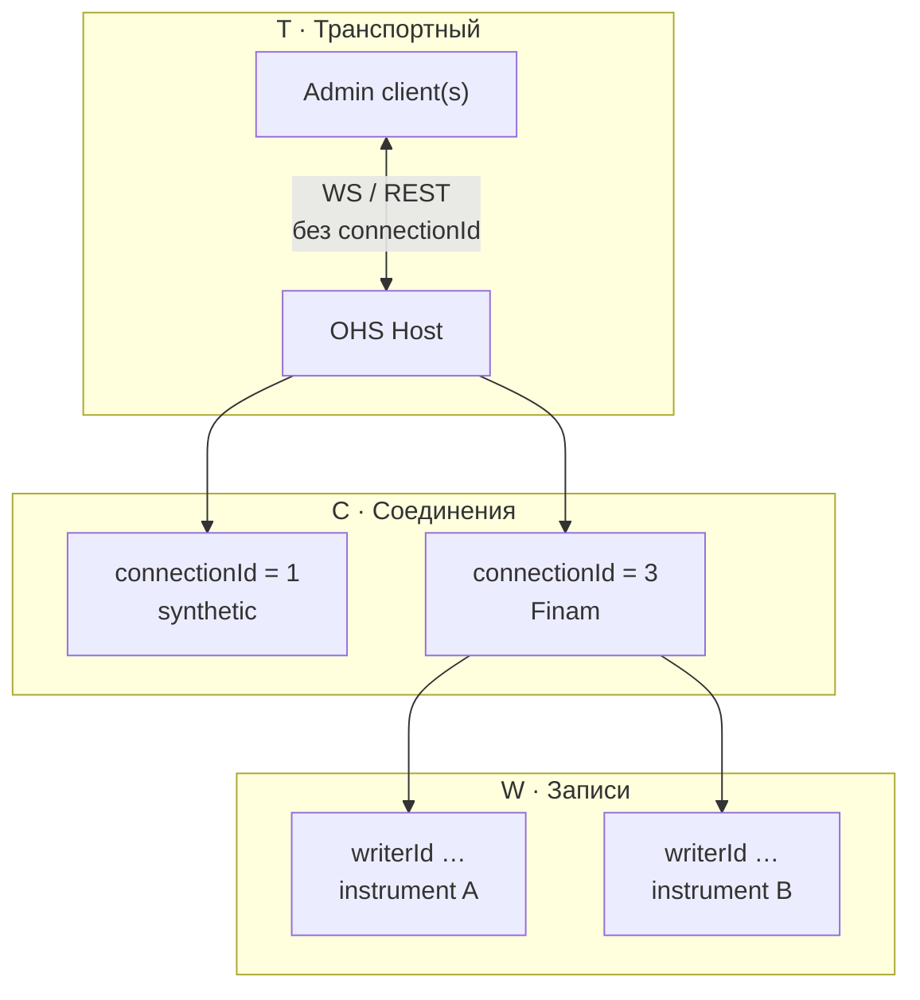
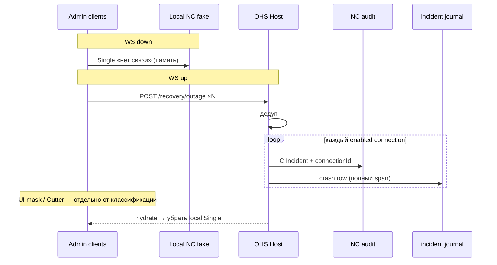

# Слои взаимодействия OHS

Плоская передача по сути **иерархической** структуры: admin ↔ Host ↔ connection ↔ запись.
В коде и в NC это выражено **слоями** — у каждого свой ключ, свой corr и свои правила журнала.

> **To-be идеология (факты ⊥ schedule):** [`schedule-projection.md`](../dev/phase11/schedule-projection.md)  
> Crash as-is: [`crash-dispatch.md`](../dev/phase11/crash-dispatch.md) · продукт: [`incident.md`](incident.md) ·
> journal: [`incident-journal.md`](../dev/phase11/incident-journal.md).

---

## 1. Зачем слои

Один сбой Host затрагивает много сущностей. Без слоёв всё сваливается в один corr /
один `connectionId` (или `null`) — ломаются фильтр NC, гант и журнал.

Слой отвечает на вопрос: **о чём это уведомление / эпизод?**

| Вопрос | Слой |
|--------|------|
| Жив ли сервер OHS для админки? | **Transport** |
| Что с конкретным брокером / провайдером? | **Connections** |
| Что с потоком записи инструмента? | **Writers** |

---

## 2. Три слоя

| Слой | Имя | Ключ | Контекст | Journal `incident` | NC (to-be) |
|------|-----|------|----------|--------------------|------------|
| **T** | **Транспортный** | нет entity-id | admin ↔ Host OHS (WS / control-plane) | **нет** (факт T); scope C — отдельно | local Single; durable T Group — off |
| **C** | **Соединения** | `connectionId` | провайдер / link к брокеру | **Incident** (полный span) | **Incident** (всегда) |
| **W** | **Записи** | `writerId` (+ `connectionId`, `instrumentId`) | захват / покрытие | recording-контур + Cutter gaps | атомы recording / coverage |

В UI «провайдер» ≈ connection; в спеке канон — **слой соединений**, ключ всегда `connectionId`.

**As-is (устаревает):** на C — Incident **или** Group в зависимости от `desired@open`; journal
только «в горизонте». To-be: schedule не классифицирует слой C.

### Иерархия



### Схема ключей

```text
Transport (T)     — нет connectionId / writerId
       │
       ▼
Connection (C)    — connectionId   (1…N enabled провайдеров)
       │
       ▼
Writer (W)        — writerId  ←  connectionId + instrumentId
```

---

## 3. Транспортный слой (T)

**Смысл:** связь админки с процессом OHS («пропала / вернулась связь с сервером»).

| | |
|--|--|
| Привязка | нет `connectionId` |
| Клиенты | режим **единого клиента** в NC: много admin POST с разными `clientId` → один эпизод |
| Journal | слой T **сам** не пишется; impact на данные — через C (fan-out или 2NF scope) |
| NC (crash) | local Single FATAL; durable T Group — **off** |
| Corr (слот) | `ohs.host.transport:{outageSeed}` — на будущее |

Фильтр NC «Соединение» не должен **прятать** транспортный смысл сбоя (to-be: либо T виден
всегда, либо отдельный toggle). As-is: local Single снимается атомами C.

---

## 4. Слой соединений (C)

**Смысл:** состояние и инциденты **конкретного** подключения к брокеру.

| | |
|--|--|
| Привязка | **обязателен** `connectionId` |
| Schedule | у каждого connection своё → используется для **Auto + mask/Cutter**, не для «писать ли journal» |
| Journal (to-be) | Incident (`type=break` \| `crash`, …), **полный span** |
| NC (to-be) | всегда Incident на connection на эпизод |
| Corr crash (as-is) | `ohs.backend.outage:{outageSeed}:c{connectionId}` |
| `clientId` | опционально в `data` для аудита |

Break (обрыв link) живёт на слое C.  
Crash Host **проецируется** на C (fan-out) после оживления бэка.

---

## 5. Слой записи (W)

**Смысл:** идёт ли захват по инструменту / сегменту покрытия.

| | |
|--|--|
| Привязка | `writerId`; связан с `connectionId` и `instrumentId` |
| Визуал | Recording-лента — бинарная проекция (blue/red), без owner/type маркеров Connection |
| Gaps (to-be) | **ScheduleCutter**: type-agnostic gaps ∩ desired — для recovery/backfill |

Детали ганта Recording — в [`incident-journal.md`](../dev/phase11/incident-journal.md) §3.0b.
Маска/Cutter — [`schedule-projection.md`](../dev/phase11/schedule-projection.md).

---

## 6. Crash dispatch: as-is vs to-be

### As-is (код сейчас)

```text
WS drop → local Single
WS up + POST × clients → Host merge
  └── C: ∀ enabled connection
        ├── desired@open → Incident + journal
        └── иначе → Group + NC (без journal)
```

Документ: [`crash-dispatch.md`](../dev/phase11/crash-dispatch.md).  
Ветка `:h` (clipped Incident) — **отклонена**, в коде нет.

### To-be

```text
WS drop → local Single
WS up + POST × clients → Host merge
  └── C: ∀ enabled connection → Incident + journal (полный span)
UI / Writers: schedule mask + Cutter поверх фактов
```



---

## 7. Инварианты

1. **T** не несёт `connectionId` в journal как «транспортная строка».
2. **C** без `connectionId` в durable NC/journal — баг (кроме переходного as-is).
3. **W** не подменяет C: дыра записи ≠ «кто чинит link».
4. **To-be:** переклассификация Group→Incident mid-flight не нужна — Group для outage уходит.
   As-is: mid-flight promote **запрещена**; только новый corr.
5. Слои визуализации ганта (`link_liveness` / `incident` / **schedule mask**) **ортогональны**
   слоям T/C/W: это отрисовка Connection-карточки, не транспорт admin↔Host.
6. SessionFilter (схлоп оси) ≠ Schedule mask (void на Full-оси).

---

## 8. Связанные документы

| Документ | О чём |
|----------|--------|
| [`schedule-projection.md`](../dev/phase11/schedule-projection.md) | **канон to-be** факты ⊥ mask/Cutter |
| [`plan-schedule-projection.md`](../dev/phase11/plan-schedule-projection.md) | порядок миграции |
| [`crash-dispatch.md`](../dev/phase11/crash-dispatch.md) | Host crash as-is |
| [`incident.md`](incident.md) | продукт: что такое инцидент |
| [`incident-journal.md`](../dev/phase11/incident-journal.md) | таблица `incident`, ленты |
| [`to-threads.md`](../dev/phase11/to-threads.md) | Single / Thread / Incident / Group |
| [`phase7j/incident.md`](../dev/phase7j/incident.md) | break/crash продюсер |
