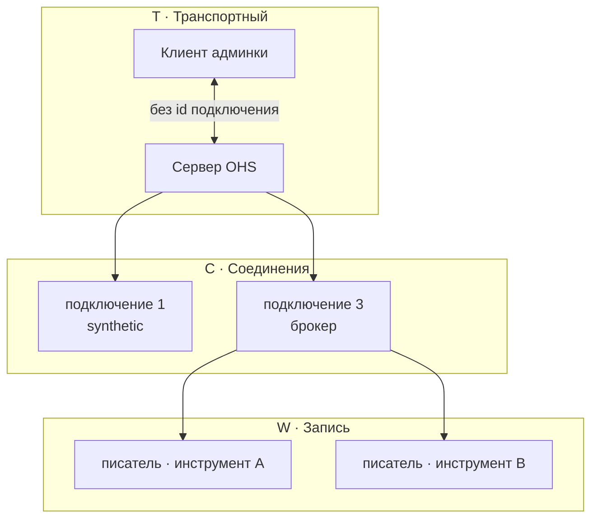
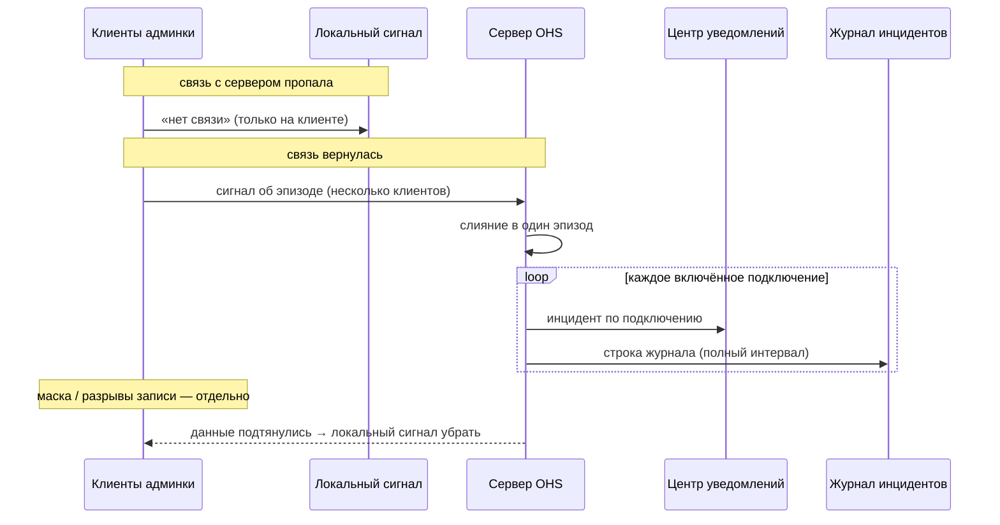

# Слои взаимодействия

Плоская лента уведомлений на самом деле отражает **иерархию**: админка ↔ сервер ↔ подключение ↔ запись.
У каждого слоя свой смысл, свой ключ и свои правила журнала.

Продукт: [incident.md](incident.md) · [write-gaps.md](write-gaps.md).

---

## 1. Зачем слои

Один сбой сервера затрагивает много сущностей. Без слоёв всё сваливается в один эпизод
без привязки к подключению — ломаются фильтр уведомлений, гант и журнал.

Слой отвечает на вопрос: **о чём это уведомление / эпизод?**

| Вопрос | Слой |
|--------|------|
| Жив ли сервер для админки? | **Транспортный** |
| Что с конкретным брокером / провайдером? | **Соединения** |
| Что с потоком записи инструмента? | **Запись** |

---

## 2. Три слоя

| Слой | Имя | Ключ | О чём | Журнал инцидентов | Уведомления |
|------|-----|------|-------|-------------------|-------------|
| **T** | Транспортный | нет id сущности | админка ↔ сервер OHS | сам слой T в журнал не пишется; влияние на данные — через соединения | локальный сигнал «нет связи с сервером»; постоянная «транспортная» нить не ведётся |
| **C** | Соединения | id подключения | провайдер / связь с брокером | инцидент на весь интервал сбоя | нить инцидента по подключению |
| **W** | Запись | id писателя (+ подключение, инструмент) | захват / покрытие | контур записи; красные разрывы — отдельно | события записи / покрытия |

В интерфейсе «провайдер» ≈ подключение; канон — **слой соединений**, ключ всегда id подключения.

На слое соединений сбой связи или влияние падения сервера — всегда **инцидент** на полный интервал.
Расписание только маскирует гант и режет разрывы записи; оно не решает, «был ли это инцидент».
Группировка «не инцидент, потому что вне окна» для таких сбоев не используется.

### Иерархия



### Схема ключей

```text
Транспортный (T)   — нет id подключения / писателя
       │
       ▼
Соединение (C)     — id подключения   (1…N включённых провайдеров)
       │
       ▼
Запись (W)         — id писателя  ←  подключение + инструмент
```

---

## 3. Транспортный слой (T)

**Смысл:** связь админки с процессом сервера («пропала / вернулась связь с OHS»).

| | |
|--|--|
| Привязка | нет id подключения |
| Клиенты | несколько окон админки → один эпизод недоступности сервера |
| Журнал | сам T не пишется строкой «транспорт»; влияние на данные — через слой соединений |
| Уведомления | локальный сигнал «нет связи»; после восстановления сервер раздаёт эпизоды по подключениям |

Фильтр «Соединения» в центре уведомлений не должен прятать смысл «упал сервер»:
транспортный слой либо виден отдельно, либо остаётся доступен своим переключателем слоёв.

---

## 4. Слой соединений (C)

**Смысл:** состояние и инциденты **конкретного** подключения к брокеру.

| | |
|--|--|
| Привязка | **обязателен** id подключения |
| Расписание | своё у каждого подключения → авто вкл/выкл и маска на ганте, не «писать ли журнал» |
| Журнал | инцидент обрыва или влияния crash на весь интервал |
| Уведомления | нить инцидента по этому подключению |

Обрыв связи с брокером живёт на слое C.  
Падение сервера **проецируется** на каждое включённое подключение после оживления сервера.

---

## 5. Слой записи (W)

**Смысл:** идёт ли захват по инструменту.

| | |
|--|--|
| Привязка | писатель; связан с подключением и инструментом |
| Визуал | подложка + сделки; красный = **разрыв записи** (без «чьей вины») |
| Разрывы | красный только там, где нужно восстанавливать историю внутри рабочего окна |

Подробнее — [write-gaps.md](write-gaps.md). Не путать с лентой соединения: дыра записи ≠ «кто чинит связь».

---

## 6. Падение сервера (кратко)

```text
Связь с сервером пропала → локальный сигнал в админке
Сервер снова доступен → клиенты сообщают об эпизоде
  └── для каждого включённого подключения: инцидент + строка журнала (полный интервал)
На ганте: маска расписания и нарезка разрывов записи — отдельно от факта «это был сбой»
```



Плановая остановка по расписанию **не** закрывает открытый сбой как «брошенный по расписанию».

---

## 7. Инварианты

1. Транспортный слой не пишется в журнал как «строка транспорта» с id подключения.
2. Слой соединений без id подключения в журнале / постоянной ленте — ошибка модели.
3. Слой записи не подменяет соединения: дыра записи ≠ «кто чинит link».
4. Сбой вне окна расписания всё равно инцидент; маска только влияет на видимость на ганте.
5. Слои отрисовки ганта (живость / инцидент / маска расписания) **ортогональны** слоям T/C/W:
   это картинка карточки подключения, не «канал админка↔сервер».
6. Фильтр оси времени («только сессия») ≠ маска расписания (затемнение на полной оси).

---

## 8. Фильтр «Слои» в центре уведомлений

Ось **слоя** в ленте уведомлений — **не** то же самое, что тумблеры break/crash на ганте.

| В интерфейсе | Что попадает |
|--------------|--------------|
| **Все** | все слои сразу (или все выключены) |
| **Транспортный** | недоступность сервера, сигналы host |
| **Коннекторы** | обрывы и события конкретного подключения |
| **Запись** | старт/стоп записи, покрытие, писатели |

**Правило:** одна нить уведомления = **один** слой. Crash остаётся транспортным, даже если
на ганте соединений подсвечены затронутые подключения.

**По умолчанию:** транспортный и коннекторы включены, запись выключена.  
Чекбоксы (не переключатель «только один»). Сброс плашки возвращает значения по умолчанию.

### Фильтр «Коннекторы» (показать / скрыть id)

Действует **только внутри слоя коннекторов**: например «не показывать id = 1».  
Транспортный слой и слой записи этим фильтром **не режутся** — их видимость решает только «Слои».

Если слой «Коннекторы» выключен, чип фильтра по id пропадает и сбрасывается;
после включения слоя фильтр нужно набрать снова.

---

## 9. Связанные страницы

| Страница | О чём |
|----------|--------|
| [incident.md](incident.md) | что такое инцидент |
| [write-gaps.md](write-gaps.md) | разрывы записи / восстановление |
| §8 выше | фильтр слоёв в центре уведомлений |
